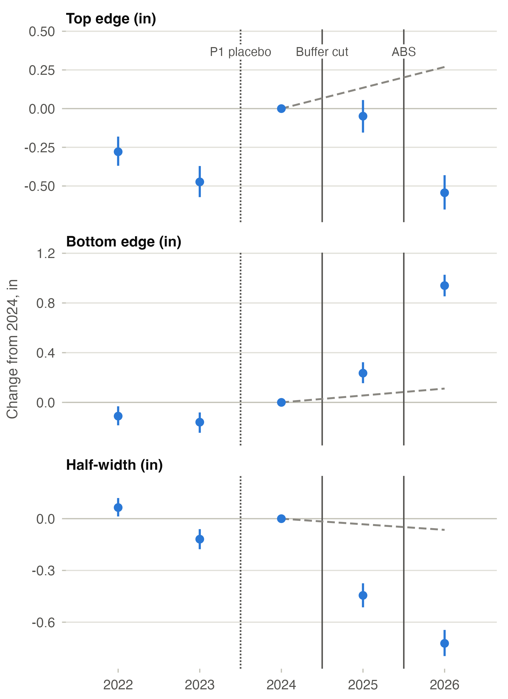
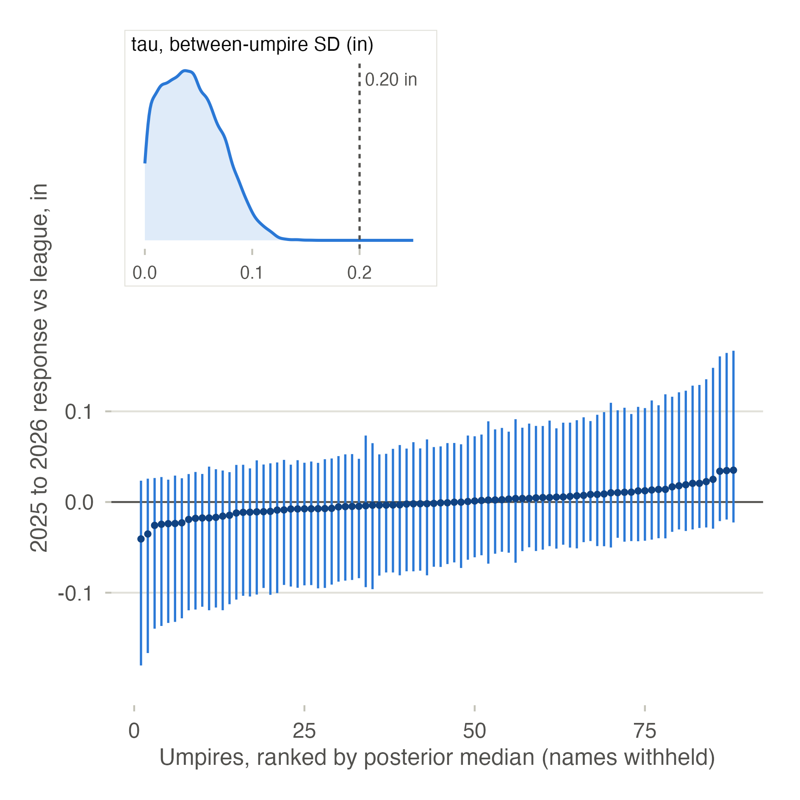
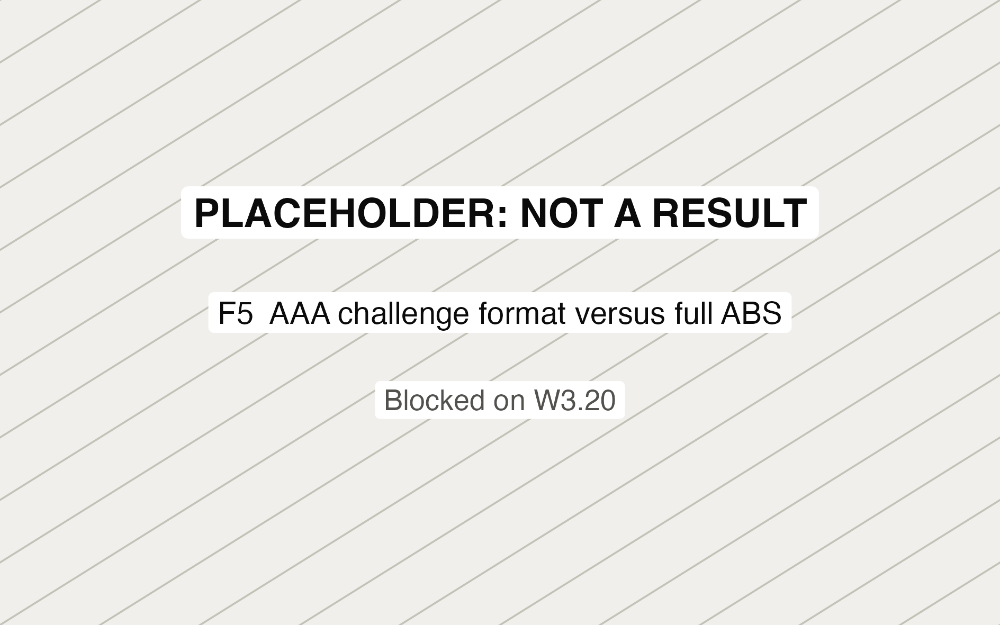
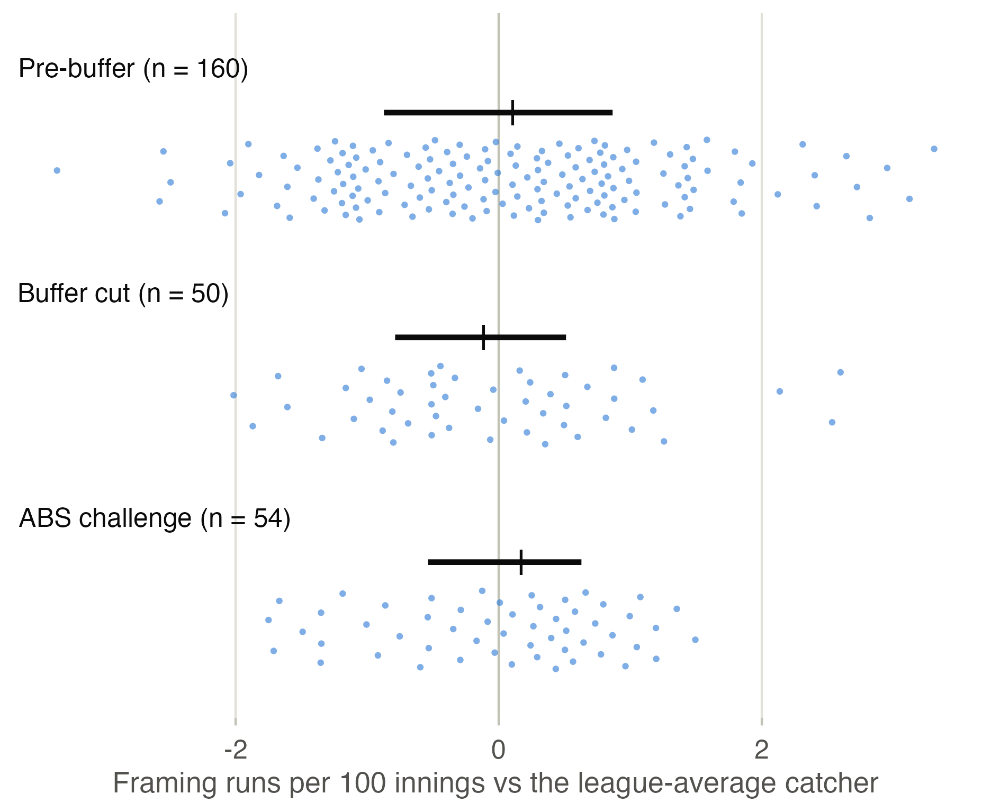
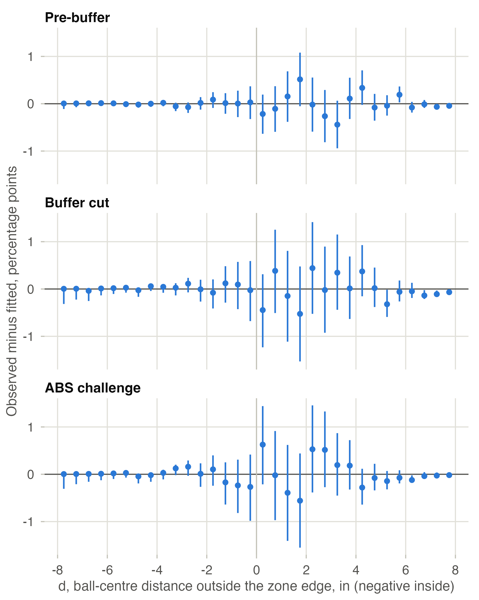
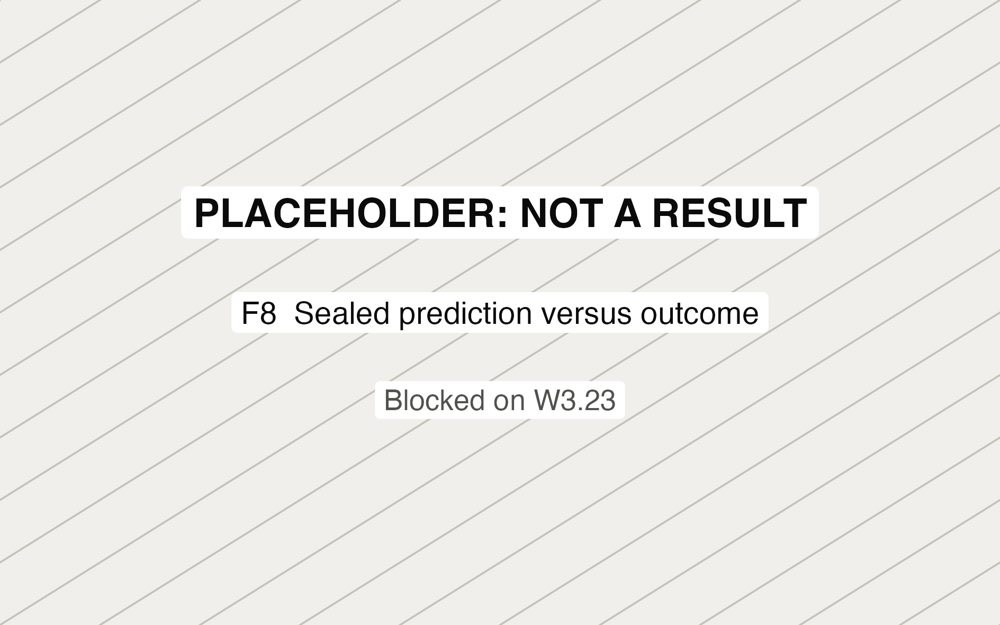

# Chapter 1: the called zone across three regimes

This file is generated by `make tables` (`R/ch1/71_tables.R`, SOP W3.24) from the figure manifest, the table CSVs and the sibling prose. Edit those sources, not this file.

## Status

- Built: figures F1, F2, F3, F4, F6, F7; tables T1, T2, T3, T4, T5, T6, T7, T9.
- **F5, AAA challenge format versus full ABS: placeholder, not a result.** It is blocked on W3.20, and `make figures` exits 3 until it lands.
- **F8, Sealed prediction versus outcome: placeholder, not a result.** It is blocked on W3.23, and `make figures` exits 3 until it lands.
- **T8, Sensitivity grid: placeholder, not a result.** It is blocked on W3.22, and `make tables` exits 3 until it lands.
- T7 is built for the open window; its sealed-set block waits on W3.23.
- Reading: placebo P1 failed (T5). Under the pre-registered consequence (PREREGISTRATION.md section 8, DEV-77) every regime contrast in this chapter is descriptive and names no cause.

## Figures

Every figure is drawn at 8 cm width for grayscale print, and writes its sidecar CSV. Each caption's numbers are rows of that sidecar.

### F1. Called-zone contours by regime

Contours where the called-strike probability is 50% for a 72-inch batter, standardised to the 2024 pitch mix, in 2024 (pre-buffer), 2025 (buffer cut) and 2026 (ABS challenge). Shading is the pointwise 95% interval of the contour along 120 rays from the zone centre, from 1,000 coefficient draws. The grey rectangle is the ABS zone, 17 in wide and 27% to 53.5% of height; the dotted line is where the ball touches it, 1.45 in outside. The lower panels enlarge the top, bottom and side edges and do not keep the aspect ratio.

Data: `out/tables/F1_data.csv`. Vector: `out/figures/F1.pdf`.

### F2. Decomposition waterfall

The change from 2024 to 2026 in each edge and in area, split by the identity Total = 2g + Buffer + ABS. 2g is two seasons of the 2022 to 2024 trend; Buffer and ABS are the departures from that trend in 2025 and 2026 (Delta_buffer and Delta_ABS). Each of those bars starts where the one before it ends, and whiskers are 95% intervals. Plane, right of the rule, is the mechanical plate-plane component of 2025, the mid-plate contour minus the front-plate contour. It sits outside the sum, because the decomposition uses mid-plate coordinates in every season; it is what a front-plate 2025 against mid-plate 2026 comparison adds. Placebo P1 failed, so the components describe departures and name no cause.

Data: `out/tables/F2_data.csv`. Vector: `out/figures/F2.pdf`.

### F3. Edge event study

Each edge's change from 2024 by season, for a 72-inch batter, with 95% intervals from the joint coefficient draws. The dotted rule is the 2023 to 2024 placebo boundary (P1), where no rule changed; the solid rules are the 2025 buffer cut and the 2026 ABS challenge. The dashed line extends the 2024 level by the 2022 to 2024 trend. P1 fails its equivalence test on area and on the shadow rate (T5), so the departures after 2024 are descriptive.

Data: `out/tables/F3_data.csv`. Vector: `out/figures/F3.pdf`.

### F4. Umpire caterpillar

Each umpire's 2025 to 2026 response relative to the league's, in inches, as a posterior median with a 90% interval from W3.18's primary model, for the 88 umpires with cells in both seasons, ranked. No umpire is named: CH1-A6's reliability gate was not met, so under D-21 no per-umpire row is published. The inset is the posterior of tau, the between-umpire SD of the response. Its rule marks CH1-A6's materiality threshold, 0.20 in, and P(tau >= 0.20 in) is 0.000.

Data: `out/tables/F4_data.csv`. Vector: `out/figures/F4.pdf`.

### F5. AAA challenge format versus full ABS

PLACEHOLDER, not a result. F5, aaa challenge format versus full abs, is drawn once W3.20 lands: W3.20, the AAA arm, is blocked on D-11's 2023 scan and D-57's 2024 changeover date (DT-29); out/ch1/prose/aaa.md does not exist.

Data: `out/tables/F5_data.csv`. Vector: `out/figures/F5.pdf`.

### F6. Framing by regime

Framing runs per 100 innings for each qualified catcher-season, relative to the league-average catcher of its season, from W3.19's catcher-free surface at count-specific run values, with every 2026 pitch kept at its original call. The strips hold 160, 50 and 54 catcher-seasons; the bar above each strip spans the interquartile range and the tick marks the median.

Data: `out/tables/F6_data.csv`. Vector: `out/figures/F6.pdf`.

### F7. Surface calibration by d bin

In-sample calibration of the primary surface by 0.5-inch bins of d, the signed distance of the ball centre from the zone edge, over +/-8 in. Each point is the observed called-strike rate minus the mean fitted probability, in percentage points, with a 95% Wilson interval on the observed rate. 1,153,067 fitted pitches; the fitted probabilities include the umpire effects. Out-of-sample calibration is F8's, on the sealed set.

Data: `out/tables/F7_data.csv`. Vector: `out/figures/F7.pdf`.

### F8. Sealed prediction versus outcome

PLACEHOLDER, not a result. F8, sealed prediction versus outcome, is drawn once W3.23 lands: W3.23, the sealed run, runs once after the season; no sealed output exists and none is read here.

Data: `out/tables/F8_data.csv`. Vector: `out/figures/F8.pdf`.

## Tables

### T1. Sample construction

The W3.5 rows count the whole open lake; the fit rows are the sample the primary surface was fitted on. Regime dates are in the CSV.

| Row | Rule |  | .1 | .2 | .3 | .4 | .5 | .6 | .7 | .8 | .9 | .10 | .11 | .12 | .13 | .14 | .15 | .16 | .17 | .18 | .19 | .20 | .21 | .22 | .23 | .24 | .25 | .26 | .27 | .28 | .29 | .30 | .31 | .32 | .33 | .34 | .35 | .36 | .37 | .38 | .39 | .40 | .41 | .42 | .43 | .44 | .45 | .46 | .47 | .48 | .49 | .50 | .51 | .52 | .53 | .54 | .55 | .56 | .57 | .58 | .59 | .60 | .61 | .62 | .63 | .64 | .65 | .66 | .67 | .68 | .69 | .70 | .71 | .72 | .73 | .74 | .75 | .76 | .77 | .78 | .79 | .80 | .81 | .82 | .83 | .84 | .85 | .86 | .87 | .88 | .89 | .90 | .91 | .92 | .93 | .94 | .95 | .96 | .97 | .98 | .99 | .100 | .101 | .102 | .103 | .104 | .105 | .106 | .107 | .108 | .109 | .110 | .111 | .112 | .113 | .114 | .115 | .116 | .117 | .118 | .119 | .120 | .121 | .122 | .123 | .124 | .125 | .126 | .127 | .128 | .129 | .130 | .131 | .132 | .133 | .134 | .135 | .136 | .137 | .138 | .139 | .140 | .141 | .142 | .143 | .144 | .145 | .146 | .147 | .148 | .149 | .150 | .151 | .152 | .153 | .154 | .155 | .156 | .157 | .158 | .159 | .160 | .161 | .162 | .163 | .164 | .165 | .166 | .167 | .168 | .169 | .170 | .171 | .172 | .173 | .174 | .175 | .176 | .177 | .178 | .179 | .180 | .181 | .182 | .183 | .184 | .185 | .186 | .187 | .188 | .189 | .190 | .191 | .192 | .193 | .194 | .195 | .196 | .197 | .198 | .199 | .200 | .201 | .202 | .203 | .204 | .205 | .206 | .207 | .208 | .209 | .210 | .211 | .212 | .213 | .214 | .215 | .216 | .217 | .218 | .219 | .220 | .221 | .222 | .223 | .224 | .225 | .226 | .227 | .228 | .229 | .230 | .231 | .232 | .233 | .234 | .235 | .236 | .237 | .238 | .239 | .240 | .241 | .242 | .243 | .244 | .245 | .246 | .247 | .248 | .249 | .250 | .251 | .252 | .253 | .254 | .255 | .256 | .257 | .258 | .259 | .260 | .261 | .262 | .263 | .264 | .265 | .266 | .267 | .268 | .269 | .270 | .271 | .272 | .273 | .274 | .275 | .276 | .277 | .278 | .279 | .280 | .281 | .282 | .283 | .284 | .285 | .286 | .287 | .288 | .289 | .290 | .291 | .292 | .293 | .294 | .295 | .296 | .297 | .298 | .299 | .300 | .301 | .302 | .303 | .304 | .305 | .306 | .307 | .308 | .309 | .310 | .311 | .312 | .313 | .314 | .315 | .316 | .317 | .318 | .319 | .320 | .321 | .322 | .323 | .324 | .325 | .326 | .327 | .328 | .329 | .330 | .331 | .332 | .333 | .334 | .335 | .336 | .337 | .338 | .339 | .340 | .341 | .342 | .343 | .344 | .345 | .346 | .347 | .348 | .349 | .350 | .351 | .352 | .353 | .354 | .355 | .356 | .357 | .358 | .359 | .360 | .361 | .362 | .363 | .364 | .365 | .366 | .367 | .368 | .369 | .370 | .371 | .372 | .373 | .374 | .375 | .376 | .377 | .378 | .379 | .380 | .381 | .382 | .383 | .384 | .385 | .386 | .387 | .388 | .389 | .390 | .391 | .392 | .393 | .394 | .395 | .396 | .397 | .398 | .399 | .400 | .401 | .402 | .403 | .404 | .405 | .406 | .407 | .408 | .409 | .410 | .411 | .412 | .413 | .414 | .415 | .416 | .417 | .418 | .419 | .420 | .421 | .422 | .423 | .424 | .425 | .426 | .427 | .428 | .429 | .430 | .431 | .432 | .433 | .434 | .435 | .436 | .437 | .438 | .439 | .440 | .441 | .442 | .443 | .444 | .445 | .446 | .447 | .448 | .449 | .450 | .451 | .452 | .453 | .454 | .455 | .456 | .457 | .458 | .459 | .460 | .461 | .462 | .463 | .464 | .465 | .466 | .467 | .468 | .469 | .470 | .471 | .472 | .473 | .474 | .475 | .476 | .477 | .478 | .479 | .480 | .481 | .482 | .483 | .484 | .485 | .486 | .487 | .488 | .489 | .490 | .491 | .492 | .493 | .494 | .495 | .496 | .497 | .498 | .499 | .500 | .501 | .502 | .503 | .504 | .505 | .506 | .507 | .508 | .509 | .510 | .511 | .512 | .513 | .514 | .515 | .516 | .517 | .518 | .519 | .520 | .521 | .522 | .523 | .524 | .525 | .526 | .527 | .528 | .529 | .530 | .531 | .532 | .533 | .534 | .535 | .536 | .537 | .538 | .539 | .540 | .541 | .542 | .543 | .544 | .545 | .546 | .547 | .548 | .549 | .550 | .551 | .552 | .553 | .554 | .555 | .556 | .557 | .558 | .559 | .560 | .561 | .562 | .563 | .564 | .565 | .566 | .567 | .568 | .569 | .570 | .571 | .572 | .573 | .574 | .575 | .576 | .577 | .578 | .579 | .580 | .581 | .582 | .583 | .584 | .585 | .586 | .587 | .588 | .589 | .590 | .591 | .592 | .593 | .594 | .595 | .596 | .597 | .598 | .599 | .600 | .601 | .602 | .603 | .604 | .605 | .606 | .607 | .608 | .609 | .610 | .611 | .612 | .613 | .614 | .615 | .616 | .617 | .618 | .619 | .620 | .621 | .622 | .623 | .624 | .625 | .626 | .627 | .628 | .629 | .630 | .631 | .632 | .633 | .634 | .635 | .636 | .637 | .638 | .639 | .640 | .641 | .642 | .643 | .644 | .645 | .646 | .647 | .648 | .649 | .650 | .651 | .652 | .653 | .654 | .655 | .656 | .657 | .658 | .659 | .660 | .661 | .662 | .663 | .664 | .665 | .666 | .667 | .668 | .669 | .670 | .671 | .672 | .673 | .674 | .675 | .676 | .677 | .678 | .679 | .680 | .681 | .682 | .683 | .684 | .685 | .686 | .687 | .688 | .689 | .690 | .691 | .692 | .693 | .694 | .695 | .696 | .697 | .698 | .699 | .700 | .701 | .702 | .703 | .704 | .705 | .706 | .707 | .708 | .709 | .710 | .711 | .712 | .713 | .714 | .715 | .716 | .717 | .718 | .719 | .720 | .721 | .722 | .723 | .724 | .725 | .726 | .727 | .728 | .729 | .730 | .731 | .732 | .733 | .734 | .735 | .736 | .737 | .738 | .739 | .740 | .741 | .742 | .743 | .744 | .745 | .746 | .747 | .748 | .749 | .750 | .751 | .752 | .753 | .754 | .755 | .756 | .757 | .758 | .759 | .760 | .761 | .762 | .763 | .764 | .765 | .766 | .767 | .768 | .769 | .770 | .771 | .772 | .773 | .774 | .775 | .776 | .777 | .778 | .779 | .780 | .781 | .782 | .783 | .784 | .785 | .786 | .787 | .788 | .789 | .790 | .791 | .792 | .793 | .794 | .795 | .796 | .797 | .798 | .799 | .800 | .801 | .802 | .803 | .804 | .805 | .806 | .807 | .808 | .809 | .810 | .811 | .812 | .813 | .814 | .815 | .816 | .817 | .818 | .819 | .820 | .821 | .822 | .823 | .824 | .825 | .826 | .827 | .828 | .829 | .830 | .831 | .832 | .833 | .834 | .835 | .836 | .837 | .838 | .839 | .840 | .841 | .842 | .843 | .844 | .845 | .846 | .847 | .848 | .849 | .850 | .851 | .852 | .853 | .854 | .855 | .856 | .857 | .858 | .859 | .860 | .861 | .862 | .863 | .864 | .865 | .866 | .867 | .868 | .869 | .870 | .871 | .872 | .873 | .874 | .875 | .876 | .877 | .878 | .879 | .880 | .881 | .882 | .883 | .884 | .885 | .886 | .887 | .888 | .889 | .890 | .891 | .892 | .893 | .894 | .895 | .896 | .897 | .898 | .899 | .900 | .901 | .902 | .903 | .904 | .905 | .906 | .907 | .908 | .909 | .910 | .911 | .912 | .913 | .914 | .915 | .916 | .917 | .918 | .919 | .920 | .921 | .922 | .923 | .924 | .925 | .926 | .927 | .928 | .929 | .930 | .931 | .932 | .933 | .934 | .935 | .936 | .937 | .938 | .939 | .940 | .941 | .942 | .943 | .944 | .945 | .946 | .947 | .948 | .949 | .950 | .951 | .952 | .953 | .954 | .955 | .956 | .957 | .958 | .959 | .960 | .961 | .962 | .963 | .964 | .965 | .966 | .967 | .968 | .969 | .970 | .971 | .972 | .973 | .974 | .975 | .976 | .977 | .978 | .979 | .980 | .981 | .982 | .983 | .984 | .985 | .986 | .987 | .988 | .989 | .990 | .991 | .992 | .993 | .994 | .995 | .996 | .997 | .998 | .999 | .1000 | .1001 | .1002 | .1003 | .1004 | .1005 | .1006 | .1007 | .1008 | .1009 | .1010 | .1011 | .1012 | .1013 | .1014 | .1015 | .1016 | .1017 | .1018 | .1019 | .1020 | .1021 | .1022 | .1023 | .1024 | .1025 | .1026 | .1027 | .1028 | .1029 | .1030 | .1031 | .1032 | .1033 | .1034 | .1035 | .1036 | .1037 | .1038 | .1039 | .1040 | .1041 | .1042 | .1043 | .1044 | .1045 | .1046 | .1047 | .1048 | .1049 | .1050 | .1051 | .1052 | .1053 | .1054 | .1055 | .1056 | .1057 | .1058 | .1059 | .1060 | .1061 | .1062 | .1063 | .1064 | .1065 | .1066 | .1067 | .1068 | .1069 | .1070 | .1071 | .1072 | .1073 | .1074 | .1075 | .1076 | .1077 | .1078 | .1079 | .1080 | .1081 | .1082 | .1083 | .1084 | .1085 | .1086 | .1087 | .1088 | .1089 | .1090 | .1091 | .1092 | .1093 | .1094 | .1095 | .1096 | .1097 | .1098 | .1099 | .1100 | .1101 | .1102 | .1103 | .1104 | .1105 | .1106 | .1107 | .1108 | .1109 | .1110 | .1111 | .1112 | .1113 | .1114 | .1115 | .1116 | .1117 | .1118 | .1119 | .1120 | .1121 | .1122 | .1123 | .1124 | .1125 | .1126 | .1127 | .1128 | .1129 | .1130 | .1131 | .1132 | .1133 | .1134 | .1135 | .1136 | .1137 | .1138 | .1139 | .1140 | .1141 | .1142 | .1143 | .1144 | .1145 | .1146 | .1147 | .1148 | .1149 | .1150 | .1151 | .1152 | .1153 | .1154 | .1155 | .1156 | .1157 | .1158 | .1159 | .1160 | .1161 | .1162 | .1163 | .1164 | .1165 | .1166 | .1167 | .1168 | .1169 | .1170 | .1171 | .1172 | .1173 | .1174 | .1175 | .1176 | .1177 | .1178 | .1179 | .1180 | .1181 | .1182 | .1183 | .1184 | .1185 | .1186 | .1187 | .1188 | .1189 | .1190 | .1191 | .1192 | .1193 | .1194 | .1195 | .1196 | .1197 | .1198 | .1199 | .1200 | .1201 | .1202 | .1203 | .1204 | .1205 | .1206 | .1207 | .1208 | .1209 | .1210 | .1211 | .1212 | .1213 | .1214 | .1215 | .1216 | .1217 | .1218 | .1219 | .1220 | .1221 | .1222 | .1223 | .1224 | .1225 | .1226 | .1227 | .1228 | .1229 | .1230 | .1231 | .1232 | .1233 | .1234 | .1235 | .1236 | .1237 | .1238 | .1239 | .1240 | .1241 | .1242 | .1243 | .1244 | .1245 | .1246 | .1247 | .1248 | .1249 | .1250 | .1251 | .1252 | .1253 | .1254 | .1255 | .1256 | .1257 | .1258 | .1259 | .1260 | .1261 | .1262 | .1263 | .1264 | .1265 | .1266 | .1267 | .1268 | .1269 | .1270 | .1271 | .1272 | .1273 | .1274 | .1275 | .1276 | .1277 | .1278 | .1279 | .1280 | .1281 | .1282 | .1283 | .1284 | .1285 | .1286 | .1287 | .1288 | .1289 | .1290 | .1291 | .1292 | .1293 | .1294 | .1295 | .1296 | .1297 | .1298 | .1299 | .1300 | .1301 | .1302 | .1303 | .1304 | .1305 | .1306 | .1307 | .1308 | .1309 | .1310 | .1311 | .1312 | .1313 | .1314 | .1315 | .1316 | .1317 | .1318 | .1319 | .1320 | .1321 | .1322 | .1323 | .1324 | .1325 | .1326 | .1327 | .1328 | .1329 | .1330 | .1331 | .1332 | .1333 | .1334 | .1335 | .1336 | .1337 | .1338 | .1339 | .1340 | .1341 | .1342 | .1343 | .1344 | .1345 | .1346 | .1347 | .1348 | .1349 | .1350 | .1351 | .1352 | .1353 | .1354 | .1355 | .1356 | .1357 | .1358 | .1359 | .1360 | .1361 | .1362 | .1363 | .1364 | .1365 | .1366 | .1367 | .1368 | .1369 | .1370 | .1371 | .1372 | .1373 | .1374 | .1375 | .1376 | .1377 | .1378 | .1379 | .1380 | .1381 | .1382 | .1383 | .1384 | .1385 | .1386 | .1387 | .1388 | .1389 | .1390 | .1391 | .1392 | .1393 | .1394 | .1395 | .1396 | .1397 | .1398 | .1399 | .1400 | .1401 | .1402 | .1403 | .1404 | .1405 | .1406 | .1407 | .1408 | .1409 | .1410 | .1411 | .1412 | .1413 | .1414 | .1415 | .1416 | .1417 | .1418 | .1419 | .1420 | .1421 | .1422 | .1423 | .1424 | .1425 | .1426 | .1427 | .1428 | .1429 | .1430 | .1431 | .1432 | .1433 | .1434 | .1435 | .1436 | .1437 | .1438 | .1439 | .1440 | .1441 | .1442 | .1443 | .1444 | .1445 | .1446 | .1447 | .1448 | .1449 | .1450 | .1451 | .1452 | .1453 | .1454 | .1455 | .1456 | .1457 | .1458 | .1459 | .1460 | .1461 | .1462 | .1463 | .1464 | .1465 | .1466 | .1467 | .1468 | .1469 | .1470 | .1471 | .1472 | .1473 | .1474 | .1475 | .1476 | .1477 | .1478 | .1479 | .1480 | .1481 | .1482 | .1483 | .1484 | .1485 | .1486 | .1487 | .1488 | .1489 | .1490 | .1491 | .1492 | .1493 | .1494 | .1495 | .1496 | .1497 | .1498 | .1499 | .1500 | .1501 | .1502 | .1503 | .1504 | .1505 | .1506 | .1507 | .1508 | .1509 | .1510 | .1511 | .1512 | .1513 | .1514 | .1515 | .1516 | .1517 | .1518 | .1519 | .1520 | .1521 | .1522 | .1523 | .1524 | .1525 | .1526 | .1527 | .1528 | .1529 | .1530 | .1531 | .1532 | .1533 | .1534 | .1535 | .1536 | .1537 | .1538 | .1539 | .1540 | .1541 | .1542 | .1543 | .1544 | .1545 | .1546 | .1547 | .1548 | .1549 | .1550 | .1551 | .1552 | .1553 | .1554 | .1555 | .1556 | .1557 | .1558 | .1559 | .1560 | .1561 | .1562 | .1563 | .1564 | .1565 | .1566 | .1567 | .1568 | .1569 | .1570 | .1571 | .1572 | .1573 | .1574 | .1575 | .1576 | .1577 | .1578 | .1579 | .1580 | .1581 | .1582 | .1583 | .1584 | .1585 | .1586 | .1587 | .1588 | .1589 | .1590 | .1591 | .1592 | .1593 | .1594 | .1595 | .1596 | .1597 | .1598 | .1599 | .1600 | .1601 | .1602 | .1603 | .1604 | .1605 | .1606 | .1607 | .1608 | .1609 | .1610 | .1611 | .1612 | .1613 | .1614 | .1615 | .1616 | .1617 | .1618 | .1619 | .1620 | .1621 | .1622 | .1623 | .1624 | .1625 | .1626 | .1627 | .1628 | .1629 | .1630 | .1631 | .1632 | .1633 | .1634 | .1635 | .1636 | .1637 | .1638 | .1639 | .1640 | .1641 | .1642 | .1643 | .1644 | .1645 | .1646 | .1647 | .1648 | .1649 | .1650 | .1651 | .1652 | .1653 | .1654 | .1655 | .1656 | .1657 | .1658 | .1659 | .1660 | .1661 | .1662 | .1663 | .1664 | .1665 | .1666 | .1667 | .1668 | .1669 | .1670 | .1671 | .1672 | .1673 | .1674 | .1675 | .1676 | .1677 | .1678 | .1679 | .1680 | .1681 | .1682 | .1683 | .1684 | .1685 | .1686 | .1687 | .1688 | .1689 | .1690 | .1691 | .1692 | .1693 | .1694 | .1695 | .1696 | .1697 | .1698 | .1699 | .1700 | .1701 | .1702 | .1703 | .1704 | .1705 | .1706 | .1707 | .1708 | .1709 | .1710 | .1711 | .1712 | .1713 | .1714 | .1715 | .1716 | .1717 | .1718 | .1719 | .1720 | .1721 | .1722 | .1723 | .1724 | .1725 | .1726 | .1727 | .1728 | .1729 | .1730 | .1731 | .1732 | .1733 | .1734 | .1735 | .1736 | .1737 | .1738 | .1739 | .1740 | .1741 | .1742 | .1743 | .1744 | .1745 | .1746 | .1747 | .1748 | .1749 | .1750 | .1751 | .1752 | .1753 | .1754 | .1755 | .1756 | .1757 | .1758 | .1759 | .1760 | .1761 | .1762 | .1763 | .1764 | .1765 | .1766 | .1767 | .1768 | .1769 | .1770 | .1771 | .1772 | .1773 | .1774 | .1775 | .1776 | .1777 | .1778 | .1779 | .1780 | .1781 | .1782 | .1783 | .1784 | .1785 | .1786 | .1787 | .1788 | .1789 | .1790 | .1791 | .1792 | .1793 | .1794 | .1795 | .1796 | .1797 | .1798 | .1799 | .1800 | .1801 | .1802 | .1803 | .1804 | .1805 | .1806 | .1807 | .1808 | .1809 | .1810 | .1811 | .1812 | .1813 | .1814 | .1815 | .1816 | .1817 | .1818 | .1819 | .1820 | .1821 | .1822 | .1823 | .1824 | .1825 | .1826 | .1827 | .1828 | .1829 | .1830 | .1831 | .1832 | .1833 | .1834 | .1835 | .1836 | .1837 | .1838 | .1839 | .1840 | .1841 | .1842 | .1843 | .1844 | .1845 | .1846 | .1847 | .1848 | .1849 | .1850 | .1851 | .1852 | .1853 | .1854 | .1855 | .1856 | .1857 | .1858 | .1859 | .1860 | .1861 | .1862 | .1863 | .1864 | .1865 | .1866 | .1867 | .1868 | .1869 | .1870 | .1871 | .1872 | .1873 | .1874 | .1875 | .1876 | .1877 | .1878 | .1879 | .1880 | .1881 | .1882 | .1883 | .1884 | .1885 | .1886 | .1887 | .1888 | .1889 | .1890 | .1891 | .1892 | .1893 | .1894 | .1895 | .1896 | .1897 | .1898 | .1899 | .1900 | .1901 | .1902 | .1903 | .1904 | .1905 | .1906 | .1907 | .1908 | .1909 | .1910 | .1911 | .1912 | .1913 | .1914 | .1915 | .1916 | .1917 | .1918 | .1919 | .1920 | .1921 | .1922 | .1923 | .1924 | .1925 | .1926 | .1927 | .1928 | .1929 | .1930 | .1931 | .1932 | .1933 | .1934 | .1935 | .1936 | .1937 | .1938 | .1939 | .1940 | .1941 | .1942 | .1943 | .1944 | .1945 | .1946 | .1947 | .1948 | .1949 | .1950 | .1951 | .1952 | .1953 | .1954 | .1955 | .1956 | .1957 | .1958 | .1959 | .1960 | .1961 | .1962 | .1963 | .1964 | .1965 | .1966 | .1967 | .1968 | .1969 | .1970 | .1971 | .1972 | .1973 | .1974 | .1975 | .1976 | .1977 | .1978 | .1979 | .1980 | .1981 | .1982 | .1983 | .1984 | .1985 | .1986 | .1987 | .1988 | .1989 | .1990 | .1991 | .1992 | .1993 | .1994 | .1995 | .1996 | .1997 | .1998 | .1999 | .2000 | .2001 | .2002 | .2003 | .2004 | .2005 | .2006 | .2007 | .2008 | .2009 | .2010 | .2011 | .2012 | .2013 | .2014 | .2015 | .2016 | .2017 | .2018 | V2022 | V2023 | V2024 | V2025 | V2026 | Total |
|---|---|---|---|---|---|---|---|---|---|---|---|---|---|---|---|---|---|---|---|---|---|---|---|---|---|---|---|---|---|---|---|---|---|---|---|---|---|---|---|---|---|---|---|---|---|---|---|---|---|---|---|---|---|---|---|---|---|---|---|---|---|---|---|---|---|---|---|---|---|---|---|---|---|---|---|---|---|---|---|---|---|---|---|---|---|---|---|---|---|---|---|---|---|---|---|---|---|---|---|---|---|---|---|---|---|---|---|---|---|---|---|---|---|---|---|---|---|---|---|---|---|---|---|---|---|---|---|---|---|---|---|---|---|---|---|---|---|---|---|---|---|---|---|---|---|---|---|---|---|---|---|---|---|---|---|---|---|---|---|---|---|---|---|---|---|---|---|---|---|---|---|---|---|---|---|---|---|---|---|---|---|---|---|---|---|---|---|---|---|---|---|---|---|---|---|---|---|---|---|---|---|---|---|---|---|---|---|---|---|---|---|---|---|---|---|---|---|---|---|---|---|---|---|---|---|---|---|---|---|---|---|---|---|---|---|---|---|---|---|---|---|---|---|---|---|---|---|---|---|---|---|---|---|---|---|---|---|---|---|---|---|---|---|---|---|---|---|---|---|---|---|---|---|---|---|---|---|---|---|---|---|---|---|---|---|---|---|---|---|---|---|---|---|---|---|---|---|---|---|---|---|---|---|---|---|---|---|---|---|---|---|---|---|---|---|---|---|---|---|---|---|---|---|---|---|---|---|---|---|---|---|---|---|---|---|---|---|---|---|---|---|---|---|---|---|---|---|---|---|---|---|---|---|---|---|---|---|---|---|---|---|---|---|---|---|---|---|---|---|---|---|---|---|---|---|---|---|---|---|---|---|---|---|---|---|---|---|---|---|---|---|---|---|---|---|---|---|---|---|---|---|---|---|---|---|---|---|---|---|---|---|---|---|---|---|---|---|---|---|---|---|---|---|---|---|---|---|---|---|---|---|---|---|---|---|---|---|---|---|---|---|---|---|---|---|---|---|---|---|---|---|---|---|---|---|---|---|---|---|---|---|---|---|---|---|---|---|---|---|---|---|---|---|---|---|---|---|---|---|---|---|---|---|---|---|---|---|---|---|---|---|---|---|---|---|---|---|---|---|---|---|---|---|---|---|---|---|---|---|---|---|---|---|---|---|---|---|---|---|---|---|---|---|---|---|---|---|---|---|---|---|---|---|---|---|---|---|---|---|---|---|---|---|---|---|---|---|---|---|---|---|---|---|---|---|---|---|---|---|---|---|---|---|---|---|---|---|---|---|---|---|---|---|---|---|---|---|---|---|---|---|---|---|---|---|---|---|---|---|---|---|---|---|---|---|---|---|---|---|---|---|---|---|---|---|---|---|---|---|---|---|---|---|---|---|---|---|---|---|---|---|---|---|---|---|---|---|---|---|---|---|---|---|---|---|---|---|---|---|---|---|---|---|---|---|---|---|---|---|---|---|---|---|---|---|---|---|---|---|---|---|---|---|---|---|---|---|---|---|---|---|---|---|---|---|---|---|---|---|---|---|---|---|---|---|---|---|---|---|---|---|---|---|---|---|---|---|---|---|---|---|---|---|---|---|---|---|---|---|---|---|---|---|---|---|---|---|---|---|---|---|---|---|---|---|---|---|---|---|---|---|---|---|---|---|---|---|---|---|---|---|---|---|---|---|---|---|---|---|---|---|---|---|---|---|---|---|---|---|---|---|---|---|---|---|---|---|---|---|---|---|---|---|---|---|---|---|---|---|---|---|---|---|---|---|---|---|---|---|---|---|---|---|---|---|---|---|---|---|---|---|---|---|---|---|---|---|---|---|---|---|---|---|---|---|---|---|---|---|---|---|---|---|---|---|---|---|---|---|---|---|---|---|---|---|---|---|---|---|---|---|---|---|---|---|---|---|---|---|---|---|---|---|---|---|---|---|---|---|---|---|---|---|---|---|---|---|---|---|---|---|---|---|---|---|---|---|---|---|---|---|---|---|---|---|---|---|---|---|---|---|---|---|---|---|---|---|---|---|---|---|---|---|---|---|---|---|---|---|---|---|---|---|---|---|---|---|---|---|---|---|---|---|---|---|---|---|---|---|---|---|---|---|---|---|---|---|---|---|---|---|---|---|---|---|---|---|---|---|---|---|---|---|---|---|---|---|---|---|---|---|---|---|---|---|---|---|---|---|---|---|---|---|---|---|---|---|---|---|---|---|---|---|---|---|---|---|---|---|---|---|---|---|---|---|---|---|---|---|---|---|---|---|---|---|---|---|---|---|---|---|---|---|---|---|---|---|---|---|---|---|---|---|---|---|---|---|---|---|---|---|---|---|---|---|---|---|---|---|---|---|---|---|---|---|---|---|---|---|---|---|---|---|---|---|---|---|---|---|---|---|---|---|---|---|---|---|---|---|---|---|---|---|---|---|---|---|---|---|---|---|---|---|---|---|---|---|---|---|---|---|---|---|---|---|---|---|---|---|---|---|---|---|---|---|---|---|---|---|---|---|---|---|---|---|---|---|---|---|---|---|---|---|---|---|---|---|---|---|---|---|---|---|---|---|---|---|---|---|---|---|---|---|---|---|---|---|---|---|---|---|---|---|---|---|---|---|---|---|---|---|---|---|---|---|---|---|---|---|---|---|---|---|---|---|---|---|---|---|---|---|---|---|---|---|---|---|---|---|---|---|---|---|---|---|---|---|---|---|---|---|---|---|---|---|---|---|---|---|---|---|---|---|---|---|---|---|---|---|---|---|---|---|---|---|---|---|---|---|---|---|---|---|---|---|---|---|---|---|---|---|---|---|---|---|---|---|---|---|---|---|---|---|---|---|---|---|---|---|---|---|---|---|---|---|---|---|---|---|---|---|---|---|---|---|---|---|---|---|---|---|---|---|---|---|---|---|---|---|---|---|---|---|---|---|---|---|---|---|---|---|---|---|---|---|---|---|---|---|---|---|---|---|---|---|---|---|---|---|---|---|---|---|---|---|---|---|---|---|---|---|---|---|---|---|---|---|---|---|---|---|---|---|---|---|---|---|---|---|---|---|---|---|---|---|---|---|---|---|---|---|---|---|---|---|---|---|---|---|---|---|---|---|---|---|---|---|---|---|---|---|---|---|---|---|---|---|---|---|---|---|---|---|---|---|---|---|---|---|---|---|---|---|---|---|---|---|---|---|---|---|---|---|---|---|---|---|---|---|---|---|---|---|---|---|---|---|---|---|---|---|---|---|---|---|---|---|---|---|---|---|---|---|---|---|---|---|---|---|---|---|---|---|---|---|---|---|---|---|---|---|---|---|---|---|---|---|---|---|---|---|---|---|---|---|---|---|---|---|---|---|---|---|---|---|---|---|---|---|---|---|---|---|---|---|---|---|---|---|---|---|---|---|---|---|---|---|---|---|---|---|---|---|---|---|---|---|---|---|---|---|---|---|---|---|---|---|---|---|---|---|---|---|---|---|---|---|---|---|---|---|---|---|---|---|---|---|---|---|---|---|---|---|---|---|---|---|---|---|---|---|---|---|---|---|---|---|---|---|---|---|---|---|---|---|---|---|---|---|---|---|---|---|---|---|---|---|---|---|---|---|---|---|---|---|---|---|---|---|---|---|---|---|---|---|---|---|---|---|---|---|---|---|---|---|---|---|---|---|---|---|---|---|---|---|---|---|---|---|---|---|---|---|---|---|---|---|---|---|---|---|---|---|---|---|---|---|---|---|---|---|---|---|---|---|---|---|---|---|---|---|---|---|---|---|---|---|---|---|---|---|---|---|---|---|---|---|---|---|---|---|---|---|---|---|---|---|---|---|---|---|---|---|---|---|---|---|---|---|---|---|---|---|---|---|---|---|---|---|---|---|---|---|---|---|---|---|---|---|---|---|---|---|---|---|---|---|---|---|---|---|---|---|---|---|---|---|---|---|---|---|---|---|---|---|---|---|---|---|---|---|---|---|---|---|---|---|---|---|---|---|---|---|---|---|---|---|---|---|---|---|---|---|---|---|---|---|---|---|---|---|---|---|---|---|---|---|---|---|---|---|---|---|---|---|---|---|---|---|---|---|---|---|---|---|---|---|---|---|---|---|---|---|---|---|---|---|---|---|---|---|---|---|---|---|---|---|---|---|---|---|---|---|---|---|---|---|---|---|---|---|---|---|---|---|---|---|---|---|---|---|---|---|---|---|---|---|---|---|---|---|---|---|---|---|---|---|---|---|---|---|---|---|---|---|---|---|---|---|---|---|---|---|---|---|---|---|---|---|---|---|---|---|---|---|---|---|---|---|---|---|---|---|---|---|---|---|---|---|---|---|---|---|---|---|---|---|---|---|---|---|---|---|---|---|---|---|---|---|---|---|---|---|---|---|---|---|---|---|---|---|---|---|---|---|---|---|---|---|---|---|---|---|---|---|---|---|---|---|---|---|---|---|---|---|---|---|---|---|---|---|---|---|---|---|---|---|---|---|---|---|---|---|---|---|---|---|---|---|---|---|---|---|---|---|---|---|---|---|---|---|---|---|---|---|---|---|---|---|---|---|---|---|---|---|---|---|---|---|---|---|---|---|---|---|---|
| S_all | every Statcast pitch in the open lake, MLB | 710,210 | 720,684 | 711,899 | 712,528 | 691,287 | 3,546,608 |
| X_automatic_ball | excluded: automatic_ball | 1,670 | 2,437 | 2,249 | 2,348 | 2,147 | 10,851 |
| X_pitchout | excluded: pitchout | 40 | 46 | 54 | 54 | 39 | 233 |
| X_hit_by_pitch | excluded: hit_by_pitch | 2,046 | 2,112 | 2,020 | 1,928 | 2,048 | 10,154 |
| X_automatic_strike | excluded: automatic_strike | 0 | 302 | 138 | 96 | 87 | 623 |
| X_not_taken | excluded: swung at, bunted or put in play | 339,309 | 341,264 | 340,421 | 339,177 | 328,505 | 1,688,676 |
| C_called | called pitches: called_strike, ball, blocked_ball | 367,145 | 374,523 | 367,017 | 368,925 | 358,461 | 1,836,071 |
| X_blank_coordinate | excluded: blank re-projected coordinate (plate_x_mid or plate_z_mid null) | 223 | 139 | 144 | 82 | 196 | 784 |
| X_position_player | excluded: pitches thrown by position players | 1,038 | 933 | 749 | 1,177 | 1,159 | 5,056 |
| K_blocked_ball | retained: blocked_ball kept as a genuine ball call | 16,010 | 15,875 | 14,977 | 15,083 | 14,318 | 76,263 |
| P0 | P0: called pitches, game_type R, official date 2022-01-01 to the last open day, non-null re-projected coordinates, position players removed | 365,884 | 373,451 | 366,124 | 367,666 | 357,106 | 1,830,231 |
| X_not_abs_measured | excluded from P1: batter height not ABS-measured | 148,681 | 102,115 | 63,941 | 27,566 | 1 | 342,304 |
| P1 | P1: P0 restricted to the ABS-measured-height cohort | 217,203 | 271,336 | 302,183 | 340,100 | 357,105 | 1,487,927 |
| B_d8_P0 | P0 rows with \|d\| <= 8.0 in on the harmonised zone (surface fit) | 226,561 | 233,626 | 227,359 | 232,907 | 233,233 | 1,153,686 |
| B_d8_P0_pct | share of P0 with \|d\| <= 8.0 in | 61.92 | 62.56 | 62.10 | 63.35 | 65.31 | 63.03 |
| B_d8_P1 | P1 rows with \|d\| <= 8.0 in | 134,251 | 168,866 | 186,878 | 215,197 | 233,232 | 938,424 |
| B_d3_P0 | P0 rows with \|d\| <= 3.0 in (shadow band) | 96,904 | 100,359 | 98,159 | 100,370 | 102,360 | 498,152 |
| B_d3_P0_pct | share of P0 with \|d\| <= 3.0 in | 26.48 | 26.87 | 26.81 | 27.30 | 28.66 | 27.22 |
| B_d3_cs_rate | called-strike rate inside \|d\| <= 3.0 in, P0 | 78.07 | 76.86 | 78.06 |  |  |  |
| Z_games | games with at least one P0 pitch | 2,429 | 2,430 | 2,429 | 2,430 | 2,342 | 12,060 |
| Z_per_game | P0 called pitches per game | 151 | 154 | 151 | 151 | 152 | 152 |
| H_abs_measured | P0 rows in the ABS-measured-height cohort (P1) | 59.36 | 72.66 | 82.54 | 92.50 | 100.00 | 81.3 |
| H_roster_offset | P0 rows whose batter has a roster height (roster plus offset cohort) | 100.00 | 100.00 | 100.00 | 100.00 | 100.00 | 100 |
| U_umpires | home-plate umpires with a P0 pitch | 96 | 94 | 90 | 92 | 91 | 114 |
| U_panel | balanced panel: umpires with >= 15 home-plate games in every season 2022-2026 | 62 | 62 | 62 | 62 | 62 | 62 |
| U_panel_P0 | P0 rows called by balanced-panel umpires | 266,480 | 283,511 | 272,293 | 276,392 | 261,762 | 1,360,438 |
| U_panel_P1 | P1 rows called by balanced-panel umpires | 158,576 | 205,897 | 224,981 | 255,840 | 261,762 | 1,107,056 |
| F_dropped | P0 rows of the games without ABS hardware, dropped by the fit code (PREREGISTRATION.md section 7) | 0 | 0 | 0 | 0 | 621 | 621 |
| F_p0_loaded | P0 as the fit code loads it | 365,884 | 373,451 | 366,124 | 367,666 | 356,485 | 1,829,610 |
| F_p0_heights | P0 after the primary height rule (roster plus cohort-specific offset, D-P4-04) | 365,884 | 373,451 | 366,124 | 367,666 | 356,485 | 1,829,610 |
| F_surface_rows | \|d\| <= 8.0 in rows the primary surface was fitted on (W3.14 main) | 226,513 | 233,551 | 227,302 | 232,886 | 232,815 | 1,153,067 |
| F_surface_games | games with a surface row | 2,429 | 2,430 | 2,429 | 2,430 | 2,338 | 12,056 |

Source: `out/tables/T1_sample_construction.csv`.

### T2. Zone gate

MLB 2026 challenged pitches: the harmonised zone against the ABS call. CH1-A1 is a hard gate.

| Row | Challenged | Agree | Disagree | Agreement, % | Threshold, % | Verdict |
|---|---|---|---|---|---|---|
| overall | 10,168 | 10,164 | 4 | 99.96 | 99.75 | PASS |
| outside_band | 7,574 | 7,573 | 1 | 99.99 | 99.95 | PASS |
| inside_band | 2,594 | 2,591 | 3 | 99.88 |  | reported |
| edge_side | 4,980 | 4,979 | 1 | 99.98 |  | reported |
| edge_top | 1,707 | 1,707 | 0 | 100.00 |  | reported |
| edge_bot | 3,481 | 3,478 | 3 | 99.91 |  | reported |
| arm_roster_offset_overall | 10,168 | 10,043 | 125 | 98.77 |  | reported |
| arm_roster_offset_outside_band | 7,575 | 7,574 | 1 | 99.99 |  | reported |

Source: `out/tables/T2_zone_gate.csv`.

### T3. Estimands by season

Primary fit, a 72-inch batter, standardised to the 2024 pitch mix; point estimate and 95% interval from the 1,000 coefficient draws. Shadow rate and count bias are in percentage points.

| Estimand | 2022 | 2023 | 2024 | 2025 | 2026 |
|---|---|---|---|---|---|
| Top edge (in) | 40.96 (40.87 to 41.05) | 40.76 (40.67 to 40.85) | 41.24 (41.14 to 41.33) | 41.19 (41.09 to 41.28) | 40.69 (40.59 to 40.79) |
| Bottom edge (in) | 16.68 (16.61 to 16.76) | 16.63 (16.56 to 16.70) | 16.79 (16.72 to 16.86) | 17.02 (16.95 to 17.10) | 17.73 (17.65 to 17.80) |
| Half-width (in) | 11.13 (11.05 to 11.19) | 10.94 (10.87 to 11.00) | 11.06 (10.99 to 11.13) | 10.62 (10.55 to 10.68) | 10.34 (10.27 to 10.40) |
| Area (sq in) | 494.6 (490.4 to 498.7) | 484.3 (480.1 to 488.1) | 495.1 (490.8 to 499.1) | 471.9 (468.0 to 475.7) | 439.1 (435.3 to 442.4) |
| Shadow-band called-strike rate (pct) | 59.04 (58.39 to 59.67) | 57.33 (56.70 to 57.93) | 58.87 (58.24 to 59.46) | 54.32 (53.72 to 54.94) | 48.18 (47.55 to 48.75) |
| Count bias (pp) | 4.55 (4.30 to 4.82) | 4.75 (4.48 to 5.02) | 4.51 (4.27 to 4.78) | 5.03 (4.75 to 5.33) | 5.73 (5.43 to 6.04) |

Source: `out/tables/T3_estimands_by_season.csv`.

### T4. Decomposition

Placebo P1 failed (T5), so the components are descriptive departures from the 2022 to 2024 trend and name no cause. The plane row is the 2025 mid-plate minus front-plate contour, outside the sum.

| Estimand | Component | Primary (95% CI) | Balanced panel (95% CI) | Panel minus primary | Binned | CH1-A5 |
|---|---|---|---|---|---|---|
| Top edge | g, per season | 0.135 (0.086 to 0.180) | 0.071 (0.026 to 0.117) | -0.064 | 0.111 |  |
| Top edge | Delta_buffer | -0.18 (-0.32 to -0.05) | -0.02 (-0.16 to 0.13) | 0.17 | -0.19 | within |
| Top edge | Delta_ABS | -0.63 (-0.76 to -0.50) | -0.65 (-0.80 to -0.51) | -0.02 | -0.72 | within |
| Top edge | Delta_total | -0.54 (-0.65 to -0.43) | -0.52 (-0.65 to -0.39) | 0.02 | -0.69 |  |
| Top edge | Delta_buffer + Delta_ABS | -0.81 (-0.98 to -0.64) | -0.66 (-0.85 to -0.48) | 0.15 | -0.91 |  |
| Top edge | share_ABS | 0.77 (0.65 to 0.92) | 0.98 (0.80 to 1.25) | 0.20 | 0.79 |  |
| Top edge | Plane, mechanical | -0.77 (-0.94 to -0.61) |  |  |  |  |
| Bottom edge | g, per season | 0.056 (0.016 to 0.093) | 0.070 (0.036 to 0.105) | 0.015 | 0.044 |  |
| Bottom edge | Delta_buffer | 0.18 (0.08 to 0.29) | 0.13 (0.02 to 0.24) | -0.05 | 0.20 | within |
| Bottom edge | Delta_ABS | 0.65 (0.55 to 0.74) | 0.63 (0.53 to 0.73) | -0.01 | 0.62 | within |
| Bottom edge | Delta_total | 0.94 (0.85 to 1.03) | 0.91 (0.82 to 1.00) | -0.03 | 0.92 |  |
| Bottom edge | Delta_buffer + Delta_ABS | 0.83 (0.69 to 0.96) | 0.77 (0.63 to 0.90) | -0.06 | 0.83 |  |
| Bottom edge | share_ABS | 0.78 (0.68 to 0.90) | 0.83 (0.72 to 0.96) | 0.04 | 0.75 |  |
| Bottom edge | Plane, mechanical | -1.11 (-1.24 to -0.98) |  |  |  |  |
| Half-width | g, per season | -0.032 (-0.060 to -0.007) | -0.029 (-0.060 to 0.002) | 0.003 | -0.012 |  |
| Half-width | Delta_buffer | -0.41 (-0.49 to -0.33) | -0.36 (-0.44 to -0.27) | 0.05 | -0.45 | within |
| Half-width | Delta_ABS | -0.25 (-0.32 to -0.16) | -0.28 (-0.36 to -0.20) | -0.03 | -0.29 | within |
| Half-width | Delta_total | -0.72 (-0.80 to -0.64) | -0.70 (-0.77 to -0.62) | 0.03 | -0.77 |  |
| Half-width | Delta_buffer + Delta_ABS | -0.66 (-0.76 to -0.54) | -0.64 (-0.75 to -0.52) | 0.02 | -0.74 |  |
| Half-width | share_ABS | 0.37 (0.27 to 0.46) | 0.43 (0.34 to 0.54) | 0.06 | 0.39 |  |
| Half-width | Plane, mechanical | 0.12 (-0.01 to 0.25) |  |  |  |  |
| Area | g, per season | 0.26 (-1.65 to 2.20) | -1.18 (-3.49 to 1.18) | -1.44 | 0.97 |  |
| Area | Delta_buffer | -23.4 (-28.3 to -18.6) | -20.3 (-26.0 to -14.0) | 3.1 | -29.5 | outside |
| Area | Delta_ABS | -33.1 (-37.5 to -28.7) | -33.8 (-38.6 to -28.8) | -0.7 | -40.7 | outside |
| Area | Delta_total | -56.0 (-59.6 to -52.0) | -56.5 (-61.0 to -52.1) | -0.5 | -68.2 |  |
| Area | Delta_buffer + Delta_ABS | -56.5 (-62.8 to -49.7) | -54.1 (-62.1 to -46.2) | 2.4 | -70.2 |  |
| Area | share_ABS | 0.59 (0.53 to 0.65) | 0.62 (0.56 to 0.71) | 0.04 | 0.58 |  |
| Area | Plane, mechanical | 12.9 (6.3 to 19.2) |  |  |  |  |
| Shadow-band called-strike rate | g, per season | -0.09 (-0.41 to 0.24) | -0.30 (-0.68 to 0.09) | -0.21 |  |  |
| Shadow-band called-strike rate | Delta_buffer | -4.46 (-5.28 to -3.63) | -3.86 (-4.83 to -2.82) | 0.60 |  |  |
| Shadow-band called-strike rate | Delta_ABS | -6.05 (-6.81 to -5.31) | -6.20 (-6.98 to -5.34) | -0.15 |  |  |
| Shadow-band called-strike rate | Delta_total | -10.69 (-11.28 to -10.04) | -10.65 (-11.39 to -9.89) | 0.04 |  |  |
| Shadow-band called-strike rate | Delta_buffer + Delta_ABS | -10.51 (-11.52 to -9.41) | -10.06 (-11.43 to -8.72) | 0.45 |  |  |
| Shadow-band called-strike rate | share_ABS | 0.58 (0.52 to 0.63) | 0.62 (0.55 to 0.69) | 0.04 |  |  |
| Count bias | g, per season | -0.02 (-0.08 to 0.05) | 0.09 (0.01 to 0.17) | 0.11 |  |  |
| Count bias | Delta_buffer | 0.54 (0.36 to 0.72) | 0.37 (0.16 to 0.58) | -0.17 |  |  |
| Count bias | Delta_ABS | 0.72 (0.56 to 0.88) | 0.75 (0.57 to 0.93) | 0.03 |  |  |
| Count bias | Delta_total | 1.22 (1.07 to 1.37) | 1.30 (1.11 to 1.47) | 0.07 |  |  |
| Count bias | Delta_buffer + Delta_ABS | 1.26 (1.00 to 1.49) | 1.12 (0.86 to 1.39) | -0.14 |  |  |
| Count bias | share_ABS | 0.57 (0.48 to 0.68) | 0.67 (0.55 to 0.84) | 0.10 |  |  |

Source: `out/tables/T4_decomposition.csv`.

### T5. Placebos

P1 is two one-sided equivalence tests at 90% (CH1-A3). P2's estimate is the mean of five All-Star break boundaries, with their range as the interval. P4's interval is the range of season rates.

| Placebo | Quantity | Units | Estimate | Interval | Level | Margin or threshold | Verdict |
|---|---|---|---|---|---|---|---|
| P1 | shadow_rate 2024 minus 2023 | pp | 1.54 | 1.03 to 2.04 | 90 | 0.50 | fail |
| P1 | area_sqin 2024 minus 2023 | sq in | 10.8 | 7.7 to 13.9 | 90 | 3.0 | fail |
| P2 | top_in second half minus first half | in | 0.32 | 0.16 to 0.47 |  | 0.46 | pass |
| P2 | bot_in second half minus first half | in | 0.01 | -0.02 to 0.09 |  | 0.07 | pass |
| P2 | half_width_in second half minus first half | in | -0.02 | -0.09 to 0.09 |  | 0.09 | pass |
| P2 | area_sqin second half minus first half | sq in | 5.3 | 2.9 to 6.8 |  | 6.7 | pass |
| P3 | AAA full-ABS rule-net area | sq in |  |  | 90 | 3.0 | not run |
| P4 | called-strike rate, d > 6 in | rate |  | 0.0002 to 0.0011 |  |  | reported |
| P4 | called-strike rate, d < - 6 in | rate |  | 0.9999 to 1.0000 |  |  | reported |

Source: `out/tables/T5_placebos.csv`.

### T6. Umpire heterogeneity

tau is the between-umpire SD of the 2025 to 2026 response, in inches. CH1-A6 calls it material only if P(tau >= 0.20 in) >= 0.90; the reading is a bounded null.

| Fit | Quantity | Units | Median (95% CI) | MT-05 |
|---|---|---|---|---|
| sop | tau_abs | in | 0.041 (0.002 to 0.100) | pass |
| sop | tau_buf | in | 0.056 (0.005 to 0.107) | pass |
| sop | sd_intercept | in | 0.154 (0.125 to 0.188) | pass |
| sop | cor_buf_abs | correlation | 0.122 (-0.649 to 0.789) | pass |
| sop | sigma | in | 0.241 (0.226 to 0.256) | pass |
| sop | fps_sd_abs | in | 0.041 (0.002 to 0.100) | pass |
| sop | league_abs_step_side | in | 0.010 (-0.065 to 0.087) | pass |
| sop | league_abs_step_top | in | 0.006 (-0.083 to 0.100) | pass |
| sop | league_abs_step_bot | in | 0.012 (-0.070 to 0.097) | pass |
| sens_abs_prior | tau_abs | in | 0.043 (0.002 to 0.102) | pass |
| sens_sd_exp1 | tau_abs | in | 0.042 (0.002 to 0.102) | pass |
| sens_sd_exp4 | tau_abs | in | 0.041 (0.002 to 0.099) | pass |
| ue_us | tau_abs | in | 0.034 (0.002 to 0.092) | pass |
| B3 | split_half_response | reliability | 0.169 |  |
| B3 | split_half_level | reliability | 0.706 |  |
| sop | reliability_vc_response | reliability | 0.185 |  |
| sop | split_half_minus_vc_response | reliability | -0.016 |  |
| CH1-A6 | p_tau_ge_020 | probability | 0.000 |  |
| CH1-A6 | bounded_null_upper95 | in | 0.092 |  |
| sens_sd_exp1 | tau_median_change_vs_sop | ratio | 0.024 |  |
| sens_sd_exp4 | tau_median_change_vs_sop | ratio | -0.013 |  |

Source: `out/tables/T6_heterogeneity.csv`.

### T7. Calibration by d bin

In-sample, by 0.5-inch bin of d over +/-8 in: observed called-strike rate minus the mean fitted probability, with 95% Wilson intervals. Every bin is in the CSV; F7 plots them. The sealed-set block is empty until W3.23 runs.

| Regime | Pitches | Bins covering zero | Mean absolute gap, pp | Largest gap, pp | At d, in |
|---|---|---|---|---|---|
| Pre-buffer | 687,366 | 30 of 32 | 0.122 | 0.52 | 1.75 |
| Buffer cut | 232,886 | 27 of 32 | 0.161 | 0.53 | 1.75 |
| ABS challenge | 232,815 | 31 of 32 | 0.194 | 0.63 | 0.25 |

Source: `out/tables/T7_calibration.csv`.

### T8. Sensitivity grid

**PLACEHOLDER, not a result.**

W3.22 has not landed: quality/receipts/W3.22.json is absent, and the verifier refuted the grid. T8 is built from W3.22's grid only once that receipt is PASS; no row of the unverified grid is read or printed here.

Source: `out/tables/T8_sensitivity.csv`.

### T9. Comparison with published work

Every published number is quoted as the prior-art ledger prints it, with its section. Each reading states where the definitions differ.

| Source | Published | Here | Units | Reading |
|---|---|---|---|---|
| Clemens (docs/prior-art.md section 6.3) | -22 to -8 sq in, point near -14 sq in | -20.0 (-28.2 to -13.0) | sq in | On his convention the change is -20.0 (95% CI -28.2 to -13.0), a point inside his interval. On mid-plate coordinates in both seasons it is -32.8 (95% CI -36.6 to -29.3); the plane component is 12.9. |
| Clemens (docs/prior-art.md section 6.3) | -0.067 to -0.033 ft, that is -0.804 to -0.396 in | -1.26 (-1.46 to -1.08) | in | On his convention the change is -1.26 (95% CI -1.46 to -1.08), a point outside his interval. On mid-plate coordinates in both seasons it is -0.49 (95% CI -0.61 to -0.38); the plane component is -0.77. |
| Clemens (docs/prior-art.md section 6.3) | -0.033 to -0.017 ft, that is -0.396 to -0.204 in | -0.40 (-0.57 to -0.24) | in | On his convention the change is -0.40 (95% CI -0.57 to -0.24), a point outside his interval. On mid-plate coordinates in both seasons it is 0.70 (95% CI 0.62 to 0.79); the plane component is -1.11. |
| Clemens (docs/prior-art.md section 6.3) | -0.075 to 0 ft in width, halved, that is -0.450 to 0.000 in | -0.15 (-0.31 to 0.01) | in | On his convention the change is -0.15 (95% CI -0.31 to 0.01), a point inside his interval. On mid-plate coordinates in both seasons it is -0.28 (95% CI -0.35 to -0.20); the plane component is 0.12. |
| Andrews (docs/prior-art.md section 6.3) | 42.7% in 2025, the lowest recorded | 54.32 (53.72 to 54.94) | percent | The 2025 rate here is -4.55 pp from 2024 (95% CI -5.18 to -3.91), the same direction as a record low. |
| Dwyer (docs/prior-art.md section 6.3) | 2.3%, 2.1%, 2.1%, 1.6% for 2022 to 2025; 1.5% in the first third of 2026 | -4.46 (-5.28 to -3.63) | pp | Both show the drop at the 2024 to 2025 boundary: here the 2025 departure from trend is -4.46 pp (95% CI -5.28 to -3.63) and the 2026 one -6.05 pp (95% CI -6.81 to -5.31). The piece reads 2025 as anticipation of ABS and does not name the buffer cut. |
| Doolittle (docs/prior-art.md section 6.3) | 0.704 | 0.576 (0.199 to 0.981) | runs per 100 innings | His figure is inside the 95% interval here, 0.199 to 0.981. |
| Doolittle (docs/prior-art.md section 6.3) | 0.565 | 0.821 (0.372 to 1.178) | runs per 100 innings | His figure is inside the 95% interval here, 0.372 to 1.178. |
| Doolittle (docs/prior-art.md section 6.3) | 0.704 to 0.565, about -20% | 42.5 (-38.7 to 316.3) | percent | The change here is 42.5% (95% CI -38.7% to 316.3%), an interval that includes his -19.7%. |
| METHODS section 8 (docs/prior-art.md sections 1.3 and 6.1) | a proposal with no output when the ledger was rechecked | 0.54 (0.36 to 0.72) | pp | Their placebo pair is the buffer-cut pair. Its departure from trend here is 0.54 pp (95% CI 0.36 to 0.72), so the pair is not a null pair. |
| METHODS section 8 (docs/prior-art.md sections 1.3 and 6.1) | a proposal with no output when the ledger was rechecked | 0.72 (0.56 to 0.88) | pp | The 2026 departure from trend on count bias is 0.72 pp (95% CI 0.56 to 0.88). |

Source: `out/tables/T9_prior_work.csv`.

## Catcher framing by regime

Folded in from `out/ch1/prose/framing.md` (W3.19) with its headings moved down one level. W3.19's test traces each of its numbers to `out/ch1/tab/framing_prose_numbers.csv`.

SOP W3.19. **Primary result.** Every number here is a row of `out/ch1/tab/framing_*.csv` or `out/tables/ch1_framing_*.csv`, listed with its source in `out/ch1/tab/framing_prose_numbers.csv`.

**External validity, CH1-A11.** Across 181 Savant-qualified catcher-seasons of 2022 to 2024, this step's count-specific framing runs correlate with Savant's `rv_tot` at r = 0.949 (95% CI 0.933 to 0.962). The pre-registered threshold is 0.85. The correlation clears it, so framing is reported as a primary result.

**Method.** Each pitch's expected strike probability comes from a catcher-free surface. It is the frozen formula of the chapter's primary surface, fitted by `bam` to P0 with no catcher term. P0 holds 1,829,610 called pitches of 2022 through 2026-09-21. Observed minus expected strikes are summed per catcher-season. Runs are centred on the league-average catcher of each season, per called pitch, in every replicate. Uncentred, that catcher earns 0.426 runs per 100 innings in 2026. The surface's count term is the strike count, and umpires call more strikes than it expects in counts with more balls. Each pitch is priced by the count-specific run value of a strike against a ball, from `delta_run_exp` over 2022 to 2024. In the first-pitch count that table gives a ball 0.036 runs and a strike -0.041. Tango's figures, 0.034 and -0.042, are the sanity check, within 0.010 runs. A flat 0.125 runs per strike is the Savant-comparable robustness column. Each interval is a 95% interval from 1,000 replicates that pair a surface draw with a catcher bootstrap. A catcher-season qualifies with a quarter of its season's mean team innings.

**Spread across catchers.** Net of binomial noise, the SD of framing runs per 100 innings across qualified catchers is 1.171 (95% CI 0.978 to 1.333) in 2022 to 2024. It is 0.945 (95% CI 0.697 to 1.162) in 2025 and 0.746 (95% CI 0.575 to 0.885) in 2026. The raw SDs, noise included, are 1.249, 1.032 and 0.862. They cover 160, 50 and 54 qualified catcher-seasons.

**Doolittle's comparable.** The top-30 mean is 0.576 runs per 100 innings (95% CI 0.199 to 0.981) in 2025. Through 2026-05-18 it is 0.821 (95% CI 0.372 to 1.178), a change of 42.5% (95% CI -38.7% to 316.3%). Doolittle reported 0.704 and 0.565 for the same windows, a change of -19.7%. Over the whole open 2026 season the top-30 mean is 0.645 (95% CI 0.372 to 0.844).

**Reliability.** Split-half reliability compares odd and even games within a catcher-season, Spearman-Brown corrected. It is 0.85 (95% CI 0.77 to 0.89) in 2022 to 2024, 0.82 (95% CI 0.67 to 0.89) in 2025 and 0.56 (95% CI 0.32 to 0.71) in 2026. The step then asks whether the reliability of framing itself fell under ABS. The 2026 minus 2025 difference is -0.26 (95% CI -0.49 to -0.05). The trend-adjusted `Delta_ABS` component is -0.25 (95% CI -0.49 to -0.03). Both intervals lie below zero, so the reliability of framing fell in 2026. Excluding challenged pitches, the SIS convention, the same difference is -0.09 (95% CI -0.24 to 0.07), and that interval includes zero.

**Decomposition.** On the signal SD, `Delta_buffer` is -0.101 (95% CI -0.417 to 0.235) runs per 100 innings. `Delta_ABS` is -0.136 (95% CI -0.523 to 0.230). On the top-30 mean the two are -0.253 (95% CI -0.815 to 0.328) and 0.110 (95% CI -0.483 to 0.608). W3.21's placebo P1 failed (CH1-A3), so these components are descriptive departures from the 2022 to 2024 trend and name no cause.

**The two 2026 conventions.** The primary keeps every pitch at its original call, the call the catcher influenced. Excluding challenged pitches, the SIS convention, the 2026 signal SD is 0.621 (95% CI 0.475 to 0.742) and the 2026 reliability 0.72 (95% CI 0.58 to 0.82). At the flat value the 2026 signal SD is 0.705 (95% CI 0.550 to 0.839).

**Surface checks.** On band rows, catcher-season rates from the framing surface and from W3.14's band surface correlate at r = 1.000 over 264 qualified catcher-seasons. On P1's band rows the framing surface and W3.14's ABS-measured surface correlate at r = 1.000.

## The AAA arm

Not written. W3.20 is blocked on D-11's 2023 scan and D-57's 2024 changeover date (DT-29). This section folds in `out/ch1/prose/aaa.md` when the sibling builder writes it. F5 and placebo P3 wait on the same step.

## How this chapter is built

- `make figures` runs `R/ch1/70_figures.R`: a cached compute stage, which needs the fitted surface, then the render.
- `make tables` runs the same compute stage, a cache hit, then `R/ch1/71_tables.R`, which also writes this file.
- Determinism is checked on the sidecars and table CSVs, never on the images.
- `tests/testthat/test-ch1-figures.R` re-reads every output and fails while any placeholder remains.
