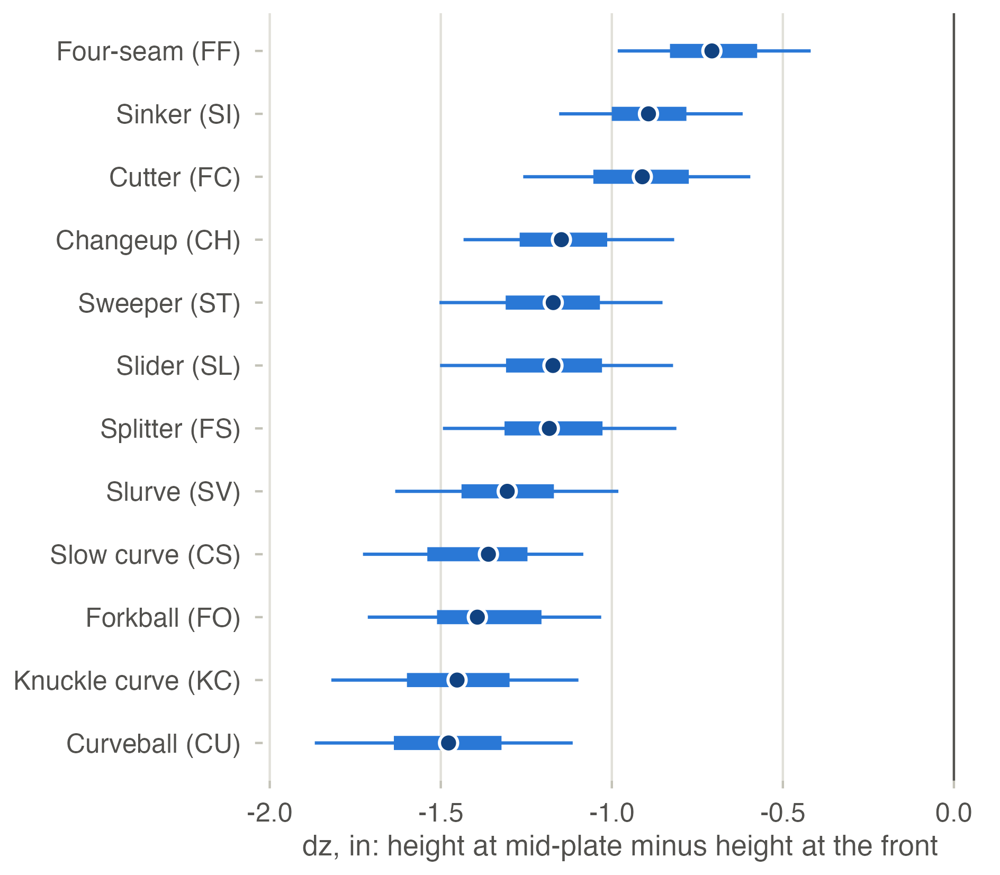

# Chapter 1: the called zone across three regimes

This file is generated by `make tables` (`R/ch1/71_tables.R`, SOP W3.24) from the figure manifest, the table CSVs and the sibling prose. Edit those sources, not this file.

## Status

- Built: figures F1, F2, F2b, F3, F4, F5, F6, F7; tables T1, T2, T3, T4, T5, T6, T7, T8, T9.
- **F8, Sealed prediction versus outcome: pending by design, not a result.** W3.23, the sealed run, has not run. Until `quality/receipts/W3.23.json` exists, F8 is a dated panel that says so and reads no sealed datum (DEV-90).
- T7 is built for the open window; its sealed-set block waits on W3.23.
- Reading: placebo P1 failed (T5). Under the pre-registered consequence (PREREGISTRATION.md section 8, DEV-77) every regime contrast in this chapter is descriptive and names no cause.
- Top-edge caveat (annex 8.7, D-R0-04): every top-edge interval in this chapter is read as slightly too narrow. In the synthetic recovery the top edge's 95% interval covered the truth in 91 of 100 replicates, against a bound of 93. Its null 90% interval lay inside +/-0.10 in for 44 of 50, against 47, so a top-edge equivalence reading is underpowered. Each top-edge row below carries this in its Annex 8.7 cell, and each figure caption with a top-edge number repeats it.
- Half-width shortfall (annex 8.7): the half-width's null 90% interval covered zero in 42 of 50 replicates, against a bound of 43. It is stated beside every half-width interval below.
- CH1-A9 is not met: the multiverse is incomplete, because `postseason_in` did not run (T8). Sign stability is stated over the 31 computed rows only, and the missing cell is the finding.
- CH1-A14: the balanced panel of 62 umpires sits beside the headline in T4 and in `out/tables/headline.csv`. On area, panel minus primary is +3.14 sq in for Delta_buffer, -0.71 for Delta_ABS and -0.45 for Delta_total (T4).

## Figures

Every figure is drawn at 8 cm width for grayscale print, and writes its sidecar CSV. Each caption's numbers are rows of that sidecar.

### F1. Called-zone contours by regime

Contours where the called-strike probability is 50% for a 72-inch batter, standardised to the 2024 pitch mix, in 2024 (pre-buffer), 2025 (buffer cut) and 2026 (ABS challenge). Shading is the pointwise 95% interval of the contour along 120 rays from the zone centre, from 1,000 coefficient draws. The grey rectangle is the ABS zone, 17 in wide and 27% to 53.5% of height; the dotted line is where the ball touches it, 1.45 in outside. The lower panels enlarge the top, bottom and side edges and do not keep the aspect ratio. Top-edge caveat (annex 8.7, D-R0-04): every top-edge interval here is read as slightly too narrow. In the synthetic recovery the top edge's 95% interval covered the truth in 91 of 100 replicates, against a bound of 93. Its null 90% interval lay within 0.10 in of zero for 44 of 50, against 47, so a top-edge equivalence reading is underpowered. Half-width shortfall (annex 8.7): its null 90% interval covered zero in 42 of 50 replicates, against a bound of 43.

Data: `out/tables/F1_data.csv`. Vector: `out/figures/F1.pdf`.

### F2. Decomposition waterfall

The change from 2024 to 2026 in each edge and in area, split by the identity Total = 2g + Buffer + ABS. 2g is two seasons of the 2022 to 2024 trend; Buffer and ABS are the departures from that trend in 2025 and 2026 (Delta_buffer and Delta_ABS). Each of those bars starts where the one before it ends, and whiskers are 95% intervals. Plane, right of the rule, is the mechanical plate-plane component of 2025, the mid-plate contour minus the front-plate contour. It sits outside the sum, because the decomposition uses mid-plate coordinates in every season; it is what a front-plate 2025 against mid-plate 2026 comparison adds. F2b shows the drop between the two planes by pitch type. Placebo P1 failed, so the components describe departures and name no cause. Top-edge caveat (annex 8.7, D-R0-04): every top-edge interval here is read as slightly too narrow. In the synthetic recovery the top edge's 95% interval covered the truth in 91 of 100 replicates, against a bound of 93. Its null 90% interval lay within 0.10 in of zero for 44 of 50, against 47, so a top-edge equivalence reading is underpowered. Half-width shortfall (annex 8.7): its null 90% interval covered zero in 42 of 50 replicates, against a bound of 43.

Data: `out/tables/F2_data.csv`. Vector: `out/figures/F2.pdf`.

### F2b. Plate-plane drop by pitch type

The drop in the ball's height between the front of the plate and mid-plate, dz, for 367,593 2025 called pitches by pitch type, from W3.17's plane table. Each dot is the median, the thick bar the interquartile range and the thin bar the 5th to 95th percentiles. Rows run from the smallest median drop to the largest. The four-seam (FF) drops least, median -0.71 in (IQR -0.83 to -0.58), and the curveball (CU) most, median -1.48 in (IQR -1.64 to -1.32). This is the by-pitch-type figure D-56 and CH1-A13 ask for; the per-edge plane component is F2's Plane bar and T4's plane row.

Data: `out/tables/F2b_data.csv`. Vector: `out/figures/F2b.pdf`.

### F3. Edge event study

Each edge's change from 2024 by season, for a 72-inch batter, with 95% intervals from the joint coefficient draws. The dotted rule is the 2023 to 2024 placebo boundary (P1), where no rule changed; the solid rules are the 2025 buffer cut and the 2026 ABS challenge. The dashed line extends the 2024 level by the 2022 to 2024 trend. P1 fails its equivalence test on area and on the shadow rate (T5), so the departures after 2024 are descriptive. Top-edge caveat (annex 8.7, D-R0-04): every top-edge interval here is read as slightly too narrow. In the synthetic recovery the top edge's 95% interval covered the truth in 91 of 100 replicates, against a bound of 93. Its null 90% interval lay within 0.10 in of zero for 44 of 50, against 47, so a top-edge equivalence reading is underpowered. Half-width shortfall (annex 8.7): its null 90% interval covered zero in 42 of 50 replicates, against a bound of 43.

Data: `out/tables/F3_data.csv`. Vector: `out/figures/F3.pdf`.

### F4. Umpire caterpillar

Each umpire's 2025 to 2026 response relative to the league's, in inches, as a posterior median with a 90% interval from W3.18's primary model, for the 88 umpires with cells in both seasons, ranked. No umpire is named: CH1-A6's reliability gate was not met, so under D-21 no per-umpire row is published. The inset is the posterior of tau, the between-umpire SD of the response. Its rule marks CH1-A6's materiality threshold, 0.20 in, and P(tau >= 0.20 in) is 0.000.

Data: `out/tables/F4_data.csv`, kept local and not published: its anonymised per-umpire rows and intervals form a per-umpire table, which D-21 and annex 8.5 withhold (DEV-83). The figure shows ranks only. Vector: `out/figures/F4.pdf`.

### F5. AAA challenge format versus full ABS

![Three stacked dot-and-interval panels. In the top panel every within-week interval lies right of zero. Pooled, the challenge-format rate is 4.23 pp above the full-ABS rate (95% CI 3.52 to 4.94). Of the six rows the top edge row is the largest, at 6.95 pp, and the bottom edge row the smallest, at 2.22 pp, both with intervals above zero. In the pre-trend panels two intervals exclude zero: area, 16.82 sq in (5.58 to 27.79), and the top edge, 0.69 in (0.50 to 0.94). The bottom edge and half-width intervals contain zero.](../out/figures/F5.png)

W3.20's AAA arm. Its committed outputs hold no contour coordinates, so the contours SOP W3.24 names are not drawn (DEV-90). The top panel is the within-week alternation. It shows the challenge-format minus full-ABS called-strike rate in the shadow band, for the same plate umpire, season and week. Points are in percentage points with 95% intervals, 96,554 pitches pooled. The frame ends before the 2024-06-25 changeover. The lower panels are the pre-trend: MLB's 2023 to 2024 change minus AAA's, binned series, primary AAA window, with 95% intervals. Area is the primary row. A filled point marks an interval that excludes 0, and there the DiD is reported as descriptive. Placebo P1 failed, so every row is descriptive. Top-edge caveat (annex 8.7, D-R0-04): every top-edge interval here is read as slightly too narrow. In the synthetic recovery the top edge's 95% interval covered the truth in 91 of 100 replicates, against a bound of 93. Its null 90% interval lay within 0.10 in of zero for 44 of 50, against 47, so a top-edge equivalence reading is underpowered. Half-width shortfall (annex 8.7): its null 90% interval covered zero in 42 of 50 replicates, against a bound of 43.

Data: `out/tables/F5_data.csv`. Vector: `out/figures/F5.pdf`.

### F6. Framing by regime

Framing runs per 100 innings for each qualified catcher-season, relative to the league-average catcher of its season, from W3.19's catcher-free surface at count-specific run values, with every 2026 pitch kept at its original call. The strips hold 160, 50 and 54 catcher-seasons; the bar above each strip spans the interquartile range and the tick marks the median.

Data: `out/tables/F6_data.csv`. Vector: `out/figures/F6.pdf`.

### F7. Surface calibration by d bin

In-sample calibration of the primary surface by 0.5-inch bins of d, the signed distance of the ball centre from the zone edge, over +/-8 in. Each point is the observed called-strike rate minus the mean fitted probability, in percentage points, with a 95% Wilson interval on the observed rate. 1,153,067 fitted pitches; the fitted probabilities include the umpire effects. Out-of-sample calibration is F8's, on the sealed set.

Data: `out/tables/F7_data.csv`. Vector: `out/figures/F7.pdf`.

### F8. Sealed prediction versus outcome

Sealed run pending, not a result. F8, sealed prediction versus outcome, is drawn from the sealed set once W3.23 has run, after 2026-11-01. Until quality/receipts/W3.23.json exists this panel is drawn on purpose and reads no sealed datum (DEV-90, recorded 2026-10-01).

Data: `out/tables/F8_data.csv`. Vector: `out/figures/F8.pdf`.

## Tables

### T1. Sample construction

The W3.5 rows count the whole open lake; the fit rows are the sample the primary surface was fitted on. Regime dates are in the CSV.

| Row | Rule | 2022 | 2023 | 2024 | 2025 | 2026 | Total |
|---|---|---|---|---|---|---|---|
| S_all | every Statcast pitch in the open lake, MLB | 710,210 | 720,684 | 711,899 | 712,528 | 691,287 | 3,546,608 |
| X_automatic_ball | excluded: automatic_ball | 1,670 | 2,437 | 2,249 | 2,348 | 2,147 | 10,851 |
| X_pitchout | excluded: pitchout | 40 | 46 | 54 | 54 | 39 | 233 |
| X_hit_by_pitch | excluded: hit_by_pitch | 2,046 | 2,112 | 2,020 | 1,928 | 2,048 | 10,154 |
| X_automatic_strike | excluded: automatic_strike | 0 | 302 | 138 | 96 | 87 | 623 |
| X_not_taken | excluded: swung at, bunted or put in play | 339,309 | 341,264 | 340,421 | 339,177 | 328,505 | 1,688,676 |
| C_called | called pitches: called_strike, ball, blocked_ball | 367,145 | 374,523 | 367,017 | 368,925 | 358,461 | 1,836,071 |
| X_blank_coordinate | excluded: blank re-projected coordinate (plate_x_mid or plate_z_mid null) | 223 | 139 | 144 | 82 | 196 | 784 |
| X_position_player | excluded: pitches thrown by position players | 1,038 | 933 | 749 | 1,177 | 1,159 | 5,056 |
| K_blocked_ball | retained: blocked_ball kept as a genuine ball call | 16,010 | 15,875 | 14,977 | 15,083 | 14,318 | 76,263 |
| P0 | P0: called pitches, game_type R, official date 2022-01-01 to the last open day, non-null re-projected coordinates, position players removed | 365,884 | 373,451 | 366,124 | 367,666 | 357,106 | 1,830,231 |
| X_not_abs_measured | excluded from P1: batter height not ABS-measured | 148,681 | 102,115 | 63,941 | 27,566 | 1 | 342,304 |
| P1 | P1: P0 restricted to the ABS-measured-height cohort | 217,203 | 271,336 | 302,183 | 340,100 | 357,105 | 1,487,927 |
| B_d8_P0 | P0 rows with \|d\| <= 8.0 in on the harmonised zone (surface fit) | 226,561 | 233,626 | 227,359 | 232,907 | 233,233 | 1,153,686 |
| B_d8_P0_pct | share of P0 with \|d\| <= 8.0 in | 61.92 | 62.56 | 62.10 | 63.35 | 65.31 | 63.03 |
| B_d8_P1 | P1 rows with \|d\| <= 8.0 in | 134,251 | 168,866 | 186,878 | 215,197 | 233,232 | 938,424 |
| B_d3_P0 | P0 rows with \|d\| <= 3.0 in (shadow band) | 96,904 | 100,359 | 98,159 | 100,370 | 102,360 | 498,152 |
| B_d3_P0_pct | share of P0 with \|d\| <= 3.0 in | 26.48 | 26.87 | 26.81 | 27.30 | 28.66 | 27.22 |
| B_d3_cs_rate | called-strike rate inside \|d\| <= 3.0 in, P0 | 78.07 | 76.86 | 78.06 |  |  |  |
| Z_games | games with at least one P0 pitch | 2,429 | 2,430 | 2,429 | 2,430 | 2,342 | 12,060 |
| Z_per_game | P0 called pitches per game | 151 | 154 | 151 | 151 | 152 | 152 |
| H_abs_measured | P0 rows in the ABS-measured-height cohort (P1) | 59.36 | 72.66 | 82.54 | 92.50 | 100.00 | 81.3 |
| H_roster_offset | P0 rows whose batter has a roster height (roster plus offset cohort) | 100.00 | 100.00 | 100.00 | 100.00 | 100.00 | 100 |
| U_umpires | home-plate umpires with a P0 pitch | 96 | 94 | 90 | 92 | 91 | 114 |
| U_panel | balanced panel: umpires with >= 15 home-plate games in every season 2022-2026 | 62 | 62 | 62 | 62 | 62 | 62 |
| U_panel_P0 | P0 rows called by balanced-panel umpires | 266,480 | 283,511 | 272,293 | 276,392 | 261,762 | 1,360,438 |
| U_panel_P1 | P1 rows called by balanced-panel umpires | 158,576 | 205,897 | 224,981 | 255,840 | 261,762 | 1,107,056 |
| F_dropped | P0 rows of the games without ABS hardware, dropped by the fit code (PREREGISTRATION.md section 7) | 0 | 0 | 0 | 0 | 621 | 621 |
| F_p0_loaded | P0 as the fit code loads it | 365,884 | 373,451 | 366,124 | 367,666 | 356,485 | 1,829,610 |
| F_p0_heights | P0 after the primary height rule (roster plus cohort-specific offset, D-P4-04) | 365,884 | 373,451 | 366,124 | 367,666 | 356,485 | 1,829,610 |
| F_surface_rows | \|d\| <= 8.0 in rows the primary surface was fitted on (W3.14 main) | 226,513 | 233,551 | 227,302 | 232,886 | 232,815 | 1,153,067 |
| F_surface_games | games with a surface row | 2,429 | 2,430 | 2,429 | 2,430 | 2,338 | 12,056 |

Source: `out/tables/T1_sample_construction.csv`.

### T2. Zone gate

MLB 2026 challenged pitches: the harmonised zone against the ABS call. CH1-A1 is a hard gate.

| Row | Challenged | Agree | Disagree | Agreement, % | Threshold, % | Verdict |
|---|---|---|---|---|---|---|
| overall | 10,168 | 10,164 | 4 | 99.96 | 99.75 | PASS |
| outside_band | 7,574 | 7,573 | 1 | 99.99 | 99.95 | PASS |
| inside_band | 2,594 | 2,591 | 3 | 99.88 |  | reported |
| edge_side | 4,980 | 4,979 | 1 | 99.98 |  | reported |
| edge_top | 1,707 | 1,707 | 0 | 100.00 |  | reported |
| edge_bot | 3,481 | 3,478 | 3 | 99.91 |  | reported |
| arm_roster_offset_overall | 10,168 | 10,043 | 125 | 98.77 |  | reported |
| arm_roster_offset_outside_band | 7,575 | 7,574 | 1 | 99.99 |  | reported |

Source: `out/tables/T2_zone_gate.csv`.

### T3. Estimands by season

Primary fit, a 72-inch batter, standardised to the 2024 pitch mix; point estimate and 95% interval from the 1,000 coefficient draws. Shadow rate and count bias are in percentage points. The Annex 8.7 cell carries the recovery caveat beside every top-edge and half-width interval (D-R0-04).

| Estimand | 2022 | 2023 | 2024 | 2025 | 2026 | Annex 8.7 |
|---|---|---|---|---|---|---|
| Top edge (in) | 40.96 (40.87 to 41.05) | 40.76 (40.67 to 40.85) | 41.24 (41.14 to 41.33) | 41.19 (41.09 to 41.28) | 40.69 (40.59 to 40.79) | read as slightly too narrow: 95% CI covered the truth in 91 of 100 (bound 93); null 90% CI inside +/-0.10 in for 44 of 50 (bound 47) |
| Bottom edge (in) | 16.68 (16.61 to 16.76) | 16.63 (16.56 to 16.70) | 16.79 (16.72 to 16.86) | 17.02 (16.95 to 17.10) | 17.73 (17.65 to 17.80) |  |
| Half-width (in) | 11.13 (11.05 to 11.19) | 10.94 (10.87 to 11.00) | 11.06 (10.99 to 11.13) | 10.62 (10.55 to 10.68) | 10.34 (10.27 to 10.40) | shortfall: null 90% CI covered zero in 42 of 50 (bound 43) |
| Area (sq in) | 494.6 (490.4 to 498.7) | 484.3 (480.1 to 488.1) | 495.1 (490.8 to 499.1) | 471.9 (468.0 to 475.7) | 439.1 (435.3 to 442.4) |  |
| Shadow-band called-strike rate (pct) | 59.04 (58.39 to 59.67) | 57.33 (56.70 to 57.93) | 58.87 (58.24 to 59.46) | 54.32 (53.72 to 54.94) | 48.18 (47.55 to 48.75) |  |
| Count bias (pp) | 4.55 (4.30 to 4.82) | 4.75 (4.48 to 5.02) | 4.51 (4.27 to 4.78) | 5.03 (4.75 to 5.33) | 5.73 (5.43 to 6.04) |  |

Source: `out/tables/T3_estimands_by_season.csv`.

### T4. Decomposition

Placebo P1 failed (T5), so the components are descriptive departures from the 2022 to 2024 trend and name no cause. The plane row is the 2025 mid-plate minus front-plate contour, outside the sum.

CH1-A14, beside the headline: the balanced panel is the 62 umpires with at least 15 home-plate games in every season 2022 to 2026 (T1). On area, panel minus primary is +3.14 sq in for Delta_buffer, -0.71 for Delta_ABS and -0.45 for Delta_total. Each panel 95% CI is in the Balanced panel column.

Annex 8.7 (D-R0-04): top-edge rows are read as slightly too narrow, and half-width rows carry their recovery shortfall, in the Annex 8.7 cell. SENS-B1-UNDERSMOOTH refits the season term with a larger basis and is reported beside the top-edge primary, never in its place.

| Estimand | Component | Primary (95% CI) | Balanced panel (95% CI) | Panel minus primary | Binned | CH1-A5 | SENS-B1-UNDERSMOOTH (95% CI) | Annex 8.7 |
|---|---|---|---|---|---|---|---|---|
| Top edge | g, per season | 0.135 (0.086 to 0.180) | 0.071 (0.026 to 0.117) | -0.0641 | 0.111 |  | 0.136 (0.086 to 0.185) | read as slightly too narrow: 95% CI covered the truth in 91 of 100 (bound 93); null 90% CI inside +/-0.10 in for 44 of 50 (bound 47) |
| Top edge | Delta_buffer | -0.18 (-0.32 to -0.05) | -0.02 (-0.16 to 0.13) | +0.167 | -0.19 | within | -0.18 (-0.32 to -0.03) | read as slightly too narrow: 95% CI covered the truth in 91 of 100 (bound 93); null 90% CI inside +/-0.10 in for 44 of 50 (bound 47) |
| Top edge | Delta_ABS | -0.63 (-0.76 to -0.50) | -0.65 (-0.80 to -0.51) | -0.019 | -0.72 | within | -0.63 (-0.76 to -0.50) | read as slightly too narrow: 95% CI covered the truth in 91 of 100 (bound 93); null 90% CI inside +/-0.10 in for 44 of 50 (bound 47) |
| Top edge | Delta_total | -0.54 (-0.65 to -0.43) | -0.52 (-0.65 to -0.39) | +0.020 | -0.69 |  | -0.54 (-0.65 to -0.42) | read as slightly too narrow: 95% CI covered the truth in 91 of 100 (bound 93); null 90% CI inside +/-0.10 in for 44 of 50 (bound 47) |
| Top edge | Delta_buffer + Delta_ABS | -0.81 (-0.98 to -0.64) | -0.66 (-0.85 to -0.48) | +0.148 | -0.91 |  | -0.82 (-1.00 to -0.62) | read as slightly too narrow: 95% CI covered the truth in 91 of 100 (bound 93); null 90% CI inside +/-0.10 in for 44 of 50 (bound 47) |
| Top edge | share_ABS | 0.77 (0.65 to 0.92) | 0.98 (0.80 to 1.25) | +0.201 | 0.79 |  | 0.77 (0.65 to 0.95) | read as slightly too narrow: 95% CI covered the truth in 91 of 100 (bound 93); null 90% CI inside +/-0.10 in for 44 of 50 (bound 47) |
| Top edge | Plane, mechanical | -0.77 (-0.94 to -0.61) |  |  |  |  |  | read as slightly too narrow: 95% CI covered the truth in 91 of 100 (bound 93); null 90% CI inside +/-0.10 in for 44 of 50 (bound 47) |
| Bottom edge | g, per season | 0.056 (0.016 to 0.093) | 0.070 (0.036 to 0.105) | +0.0147 | 0.044 |  |  |  |
| Bottom edge | Delta_buffer | 0.18 (0.08 to 0.29) | 0.13 (0.02 to 0.24) | -0.046 | 0.20 | within |  |  |
| Bottom edge | Delta_ABS | 0.65 (0.55 to 0.74) | 0.63 (0.53 to 0.73) | -0.015 | 0.62 | within |  |  |
| Bottom edge | Delta_total | 0.94 (0.85 to 1.03) | 0.91 (0.82 to 1.00) | -0.032 | 0.92 |  |  |  |
| Bottom edge | Delta_buffer + Delta_ABS | 0.83 (0.69 to 0.96) | 0.77 (0.63 to 0.90) | -0.061 | 0.83 |  |  |  |
| Bottom edge | share_ABS | 0.78 (0.68 to 0.90) | 0.83 (0.72 to 0.96) | +0.043 | 0.75 |  |  |  |
| Bottom edge | Plane, mechanical | -1.11 (-1.24 to -0.98) |  |  |  |  |  |  |
| Half-width | g, per season | -0.032 (-0.060 to -0.007) | -0.029 (-0.060 to 0.002) | +0.0032 | -0.012 |  |  | shortfall: null 90% CI covered zero in 42 of 50 (bound 43) |
| Half-width | Delta_buffer | -0.41 (-0.49 to -0.33) | -0.36 (-0.44 to -0.27) | +0.050 | -0.45 | within |  | shortfall: null 90% CI covered zero in 42 of 50 (bound 43) |
| Half-width | Delta_ABS | -0.25 (-0.32 to -0.16) | -0.28 (-0.36 to -0.20) | -0.031 | -0.29 | within |  | shortfall: null 90% CI covered zero in 42 of 50 (bound 43) |
| Half-width | Delta_total | -0.72 (-0.80 to -0.64) | -0.70 (-0.77 to -0.62) | +0.026 | -0.77 |  |  | shortfall: null 90% CI covered zero in 42 of 50 (bound 43) |
| Half-width | Delta_buffer + Delta_ABS | -0.66 (-0.76 to -0.54) | -0.64 (-0.75 to -0.52) | +0.019 | -0.74 |  |  | shortfall: null 90% CI covered zero in 42 of 50 (bound 43) |
| Half-width | share_ABS | 0.37 (0.27 to 0.46) | 0.43 (0.34 to 0.54) | +0.060 | 0.39 |  |  | shortfall: null 90% CI covered zero in 42 of 50 (bound 43) |
| Half-width | Plane, mechanical | 0.12 (-0.01 to 0.25) |  |  |  |  |  | shortfall: null 90% CI covered zero in 42 of 50 (bound 43) |
| Area | g, per season | 0.26 (-1.65 to 2.20) | -1.18 (-3.49 to 1.18) | -1.439 | 0.97 |  |  |  |
| Area | Delta_buffer | -23.4 (-28.3 to -18.6) | -20.3 (-26.0 to -14.0) | +3.14 | -29.5 | outside |  |  |
| Area | Delta_ABS | -33.1 (-37.5 to -28.7) | -33.8 (-38.6 to -28.8) | -0.71 | -40.7 | outside |  |  |
| Area | Delta_total | -56.0 (-59.6 to -52.0) | -56.5 (-61.0 to -52.1) | -0.45 | -68.2 |  |  |  |
| Area | Delta_buffer + Delta_ABS | -56.5 (-62.8 to -49.7) | -54.1 (-62.1 to -46.2) | +2.43 | -70.2 |  |  |  |
| Area | share_ABS | 0.59 (0.53 to 0.65) | 0.62 (0.56 to 0.71) | +0.039 | 0.58 |  |  |  |
| Area | Plane, mechanical | 12.9 (6.3 to 19.2) |  |  |  |  |  |  |
| Shadow-band called-strike rate | g, per season | -0.09 (-0.41 to 0.24) | -0.30 (-0.68 to 0.09) | -0.210 |  |  |  |  |
| Shadow-band called-strike rate | Delta_buffer | -4.46 (-5.28 to -3.63) | -3.86 (-4.83 to -2.82) | +0.604 |  |  |  |  |
| Shadow-band called-strike rate | Delta_ABS | -6.05 (-6.81 to -5.31) | -6.20 (-6.98 to -5.34) | -0.150 |  |  |  |  |
| Shadow-band called-strike rate | Delta_total | -10.69 (-11.28 to -10.04) | -10.65 (-11.39 to -9.89) | +0.035 |  |  |  |  |
| Shadow-band called-strike rate | Delta_buffer + Delta_ABS | -10.51 (-11.52 to -9.41) | -10.06 (-11.43 to -8.72) | +0.454 |  |  |  |  |
| Shadow-band called-strike rate | share_ABS | 0.58 (0.52 to 0.63) | 0.62 (0.55 to 0.69) | +0.041 |  |  |  |  |
| Count bias | g, per season | -0.02 (-0.08 to 0.05) | 0.09 (0.01 to 0.17) | +0.108 |  |  |  |  |
| Count bias | Delta_buffer | 0.54 (0.36 to 0.72) | 0.37 (0.16 to 0.58) | -0.174 |  |  |  |  |
| Count bias | Delta_ABS | 0.72 (0.56 to 0.88) | 0.75 (0.57 to 0.93) | +0.032 |  |  |  |  |
| Count bias | Delta_total | 1.22 (1.07 to 1.37) | 1.30 (1.11 to 1.47) | +0.074 |  |  |  |  |
| Count bias | Delta_buffer + Delta_ABS | 1.26 (1.00 to 1.49) | 1.12 (0.86 to 1.39) | -0.142 |  |  |  |  |
| Count bias | share_ABS | 0.57 (0.48 to 0.68) | 0.67 (0.55 to 0.84) | +0.101 |  |  |  |  |

Source: `out/tables/T4_decomposition.csv`.

### T5. Placebos

P1 is two one-sided equivalence tests at 90% (CH1-A3). P2's estimate is the mean of five All-Star break boundaries, with their range as the interval. P3's rows are W3.20's machine-drift placebo, read from `out/tables/aaa_placebo.csv`: two one-sided tests at 90% on AAA's rule-net machine-day area. A change is not evaluable when a season has no keyless full-ABS game on disk. P4's interval is the range of season rates.

| Placebo | Quantity | Units | Estimate | Interval | Level | Margin or threshold | Verdict | Annex 8.7 |
|---|---|---|---|---|---|---|---|---|
| P1 | shadow_rate 2024 minus 2023 | pp | 1.54 | 1.03 to 2.04 | 90 | 0.50 | fail |  |
| P1 | area_sqin 2024 minus 2023 | sq in | 10.8 | 7.7 to 13.9 | 90 | 3.0 | fail |  |
| P2 | top_in second half minus first half | in | 0.32 | 0.16 to 0.47 |  | 0.46 | pass | read as slightly too narrow: 95% CI covered the truth in 91 of 100 (bound 93); null 90% CI inside +/-0.10 in for 44 of 50 (bound 47) |
| P2 | bot_in second half minus first half | in | 0.01 | -0.02 to 0.09 |  | 0.07 | pass |  |
| P2 | half_width_in second half minus first half | in | -0.02 | -0.09 to 0.09 |  | 0.09 | pass | shortfall: null 90% CI covered zero in 42 of 50 (bound 43) |
| P2 | area_sqin second half minus first half | sq in | 5.3 | 2.9 to 6.8 |  | 6.7 | pass |  |
| P3 | AAA full-ABS rule-net area 2024 minus 2023 | sq in | 0.4 | -0.4 to 1.2 | 90 | 3.0 | pass |  |
| P3 | AAA full-ABS rule-net area 2025 minus 2024 | sq in |  |  | 90 | 3.0 | not evaluable |  |
| P4 | called-strike rate, d > 6 in | rate |  | 0.0002 to 0.0011 |  |  | reported |  |
| P4 | called-strike rate, d < - 6 in | rate |  | 0.9999 to 1.0000 |  |  | reported |  |

Source: `out/tables/T5_placebos.csv`.

### T6. Umpire heterogeneity

tau is the between-umpire SD of the 2025 to 2026 response, in inches. CH1-A6 calls it material only if P(tau >= 0.20 in) >= 0.90; the reading is a bounded null.

| Fit | Quantity | Units | Median (95% CI) | MT-05 |
|---|---|---|---|---|
| sop | tau_abs | in | 0.041 (0.002 to 0.100) | pass |
| sop | tau_buf | in | 0.056 (0.005 to 0.107) | pass |
| sop | sd_intercept | in | 0.154 (0.125 to 0.188) | pass |
| sop | cor_buf_abs | correlation | 0.122 (-0.649 to 0.789) | pass |
| sop | sigma | in | 0.241 (0.226 to 0.256) | pass |
| sop | fps_sd_abs | in | 0.041 (0.002 to 0.100) | pass |
| sop | league_abs_step_side | in | 0.010 (-0.065 to 0.087) | pass |
| sop | league_abs_step_top | in | 0.006 (-0.083 to 0.100) | pass |
| sop | league_abs_step_bot | in | 0.012 (-0.070 to 0.097) | pass |
| sens_abs_prior | tau_abs | in | 0.043 (0.002 to 0.102) | pass |
| sens_sd_exp1 | tau_abs | in | 0.042 (0.002 to 0.102) | pass |
| sens_sd_exp4 | tau_abs | in | 0.041 (0.002 to 0.099) | pass |
| ue_us | tau_abs | in | 0.034 (0.002 to 0.092) | pass |
| B3 | split_half_response | reliability | 0.169 |  |
| B3 | split_half_level | reliability | 0.706 |  |
| sop | reliability_vc_response | reliability | 0.185 |  |
| sop | split_half_minus_vc_response | reliability | -0.016 |  |
| CH1-A6 | p_tau_ge_020 | probability | 0.000 |  |
| CH1-A6 | bounded_null_upper95 | in | 0.092 |  |
| sens_sd_exp1 | tau_median_change_vs_sop | ratio | 0.024 |  |
| sens_sd_exp4 | tau_median_change_vs_sop | ratio | -0.013 |  |

Source: `out/tables/T6_heterogeneity.csv`.

### T7. Calibration by d bin

In-sample, by 0.5-inch bin of d over +/-8 in: observed called-strike rate minus the mean fitted probability, with 95% Wilson intervals. Every bin is in the CSV; F7 plots them. The sealed-set block is empty until W3.23 runs.

| Regime | Pitches | Bins covering zero | Mean absolute gap, pp | Largest gap, pp | At d, in |
|---|---|---|---|---|---|
| Pre-buffer | 687,366 | 30 of 32 | 0.122 | 0.52 | 1.75 |
| Buffer cut | 232,886 | 27 of 32 | 0.161 | 0.53 | 1.75 |
| ABS challenge | 232,815 | 31 of 32 | 0.194 | 0.63 | 0.25 |

Source: `out/tables/T7_calibration.csv`.

### T8. Sensitivity grid

**CH1-A9 is not met, because the multiverse is incomplete. That is the finding, and `postseason_in` is the missing cell.**

The grid, `out/ch1/tab/sensitivity_grid.csv` (W3.22), holds 32 rows: 26 binned rows that ran, 1 binned cell not run, and 5 `bam` rows that ran. The 5 `bam` rows are `primary`, `height_abs_cohort`, `plane_front`, `k_0.75x` and `mix_unweighted`, so 31 rows were computed.

`postseason_in` is deferred: the warehouse's open view holds no 2022-2025 postseason called pitch (game_type F, D, L, W).

Over the 31 computed rows only, Delta_buffer and Delta_ABS each keep one sign on area, the top edge, the bottom edge, the half-width and the shadow rate. Against the `bam` primary, Delta_buffer has 0 sign flips and Delta_ABS 0, and 0 of their intervals cross zero.

The share clause is met: the primary sum's 95% interval on area, -62.8 to -49.7 sq in (T4), excludes zero. Every binned row's area interval excludes the `bam` primary, the CH1-A5 gap T4 reports as a limitation. Top-edge and half-width rows carry annex 8.7's caveat in the CSV's recovery_disclosure column.

| Cell | Factor | Estimator | Status | Delta_buffer, area (95% CI) | Delta_ABS, area (95% CI) | Flags |
|---|---|---|---|---|---|---|
| primary | primary | binned | ran | -29.5 (-32.6 to -26.4) | -40.7 (-43.6 to -38.0) | excludes the bam primary |
| r_0 | r | binned | ran | -29.5 (-32.6 to -26.4) | -40.7 (-43.6 to -38.0) | excludes the bam primary |
| r_1.0 | r | binned | ran | -29.5 (-32.6 to -26.4) | -40.7 (-43.6 to -38.0) | excludes the bam primary |
| r_1.45 | r | binned | ran | -29.5 (-32.6 to -26.4) | -40.7 (-43.6 to -38.0) | excludes the bam primary |
| r_fitted | r | binned | ran | -29.5 (-32.6 to -26.4) | -40.7 (-43.6 to -38.0) | excludes the bam primary |
| height_abs_cohort | height source | binned | ran | -28.9 (-32.0 to -25.8) | -38.6 (-41.6 to -35.8) | excludes the bam primary |
| height_roster_offset | height source | binned | ran | -29.5 (-32.6 to -26.4) | -40.7 (-43.6 to -38.0) | excludes the bam primary |
| height_ml_offset | height source | binned | ran | -29.7 (-32.9 to -26.8) | -40.5 (-43.5 to -38.0) | excludes the bam primary |
| shadow_2 | shadow band | binned | ran | -29.5 (-32.6 to -26.4) | -40.7 (-43.6 to -38.0) | excludes the bam primary |
| shadow_3 | shadow band | binned | ran | -29.5 (-32.6 to -26.4) | -40.7 (-43.6 to -38.0) | excludes the bam primary |
| shadow_4 | shadow band | binned | ran | -29.5 (-32.6 to -26.4) | -40.7 (-43.6 to -38.0) | excludes the bam primary |
| band_6 | band restriction | binned | ran | -29.0 (-32.2 to -25.8) | -40.5 (-43.3 to -37.7) | excludes the bam primary |
| band_8 | band restriction | binned | ran | -29.5 (-32.6 to -26.4) | -40.7 (-43.6 to -38.0) | excludes the bam primary |
| band_unrestricted | band restriction | binned | ran | -29.7 (-32.5 to -26.8) | -40.6 (-43.5 to -38.0) | excludes the bam primary |
| plane_mid | plane | binned | ran | -29.5 (-32.6 to -26.4) | -40.7 (-43.6 to -38.0) | excludes the bam primary |
| plane_front | plane | binned | ran | -28.0 (-30.7 to -25.4) | -37.6 (-40.4 to -35.0) | excludes the bam primary; excludes its estimator's primary |
| blocked_ball_in | blocked_ball | binned | ran | -29.5 (-32.6 to -26.4) | -40.7 (-43.6 to -38.0) | excludes the bam primary |
| blocked_ball_out | blocked_ball | binned | ran | -29.5 (-32.6 to -26.5) | -40.7 (-43.6 to -37.8) | excludes the bam primary |
| pp_in | position-player pitchers | binned | ran | -28.9 (-32.0 to -26.0) | -40.2 (-43.1 to -37.4) | excludes the bam primary |
| pp_out | position-player pitchers | binned | ran | -29.5 (-32.6 to -26.4) | -40.7 (-43.6 to -38.0) | excludes the bam primary |
| postseason_in | postseason | binned | deferred: the warehouse's open view holds no 2022-2025 postseason called pitch (game_type F, D, L, W) |  |  | not run |
| postseason_out | postseason | binned | ran | -29.5 (-32.6 to -26.4) | -40.7 (-43.6 to -38.0) | excludes the bam primary |
| k_0.75x | k | binned | ran | -29.4 (-32.3 to -26.6) | -39.9 (-42.5 to -37.6) | excludes the bam primary |
| k_1.5x | k | binned | ran | -29.2 (-32.3 to -25.8) | -41.1 (-44.3 to -37.3) | excludes the bam primary |
| mix_2024 | standardisation mix | binned | ran | -29.5 (-32.6 to -26.4) | -40.7 (-43.6 to -38.0) | excludes the bam primary |
| mix_2025 | standardisation mix | binned | ran | -29.5 (-32.7 to -26.4) | -40.7 (-43.6 to -38.0) | excludes the bam primary |
| mix_unweighted | standardisation mix | binned | ran | -29.6 (-32.4 to -26.9) | -39.8 (-42.7 to -37.0) | excludes the bam primary |
| primary | primary | bam | ran | -23.4 (-28.3 to -18.6) | -33.1 (-37.5 to -28.7) |  |
| height_abs_cohort | height source | bam | ran | -23.8 (-29.3 to -18.4) | -32.2 (-36.8 to -27.9) |  |
| plane_front | plane | bam | ran | -22.2 (-27.3 to -16.8) | -31.8 (-35.7 to -27.8) |  |
| k_0.75x | k | bam | ran | -23.4 (-28.5 to -18.5) | -33.1 (-37.2 to -29.1) |  |
| mix_unweighted | standardisation mix | bam | ran | -22.5 (-27.3 to -17.3) | -31.6 (-35.6 to -27.6) |  |

Source: `out/tables/T8_sensitivity.csv`.

### T9. Comparison with published work

Every published number is quoted as the prior-art ledger prints it, with its section. Each reading states where the definitions differ.

| Source | Published | Here | Units | Reading |
|---|---|---|---|---|
| Clemens (docs/prior-art.md section 6.3) | -22 to -8 sq in, point near -14 sq in | -20.0 (-28.2 to -13.0) | sq in | On his convention the change is -20.0 (95% CI -28.2 to -13.0), a point inside his interval. On mid-plate coordinates in both seasons it is -32.8 (95% CI -36.6 to -29.3); the plane component is 12.9. |
| Clemens (docs/prior-art.md section 6.3) | -0.067 to -0.033 ft, that is -0.804 to -0.396 in | -1.26 (-1.46 to -1.08) | in | On his convention the change is -1.26 (95% CI -1.46 to -1.08), a point outside his interval. On mid-plate coordinates in both seasons it is -0.49 (95% CI -0.61 to -0.38); the plane component is -0.77. Annex 8.7: read as slightly too narrow: 95% CI covered the truth in 91 of 100 (bound 93); null 90% CI inside +/-0.10 in for 44 of 50 (bound 47). |
| Clemens (docs/prior-art.md section 6.3) | -0.033 to -0.017 ft, that is -0.396 to -0.204 in | -0.40 (-0.57 to -0.24) | in | On his convention the change is -0.40 (95% CI -0.57 to -0.24), a point outside his interval. On mid-plate coordinates in both seasons it is 0.70 (95% CI 0.62 to 0.79); the plane component is -1.11. |
| Clemens (docs/prior-art.md section 6.3) | -0.075 to 0 ft in width, halved, that is -0.450 to 0.000 in | -0.15 (-0.31 to 0.01) | in | On his convention the change is -0.15 (95% CI -0.31 to 0.01), a point inside his interval. On mid-plate coordinates in both seasons it is -0.28 (95% CI -0.35 to -0.20); the plane component is 0.12. Annex 8.7: shortfall: null 90% CI covered zero in 42 of 50 (bound 43). |
| Andrews (docs/prior-art.md section 6.3) | 42.7% in 2025, the lowest recorded | 54.32 (53.72 to 54.94) | percent | The 2025 rate here is -4.55 pp from 2024 (95% CI -5.18 to -3.91), the same direction as a record low. |
| Dwyer (docs/prior-art.md section 6.3) | 2.3%, 2.1%, 2.1%, 1.6% for 2022 to 2025; 1.5% in the first third of 2026 | -4.46 (-5.28 to -3.63) | pp | Both show the drop at the 2024 to 2025 boundary: here the 2025 departure from trend is -4.46 pp (95% CI -5.28 to -3.63) and the 2026 one -6.05 pp (95% CI -6.81 to -5.31). The piece reads 2025 as anticipation of ABS and does not name the buffer cut. |
| Doolittle (docs/prior-art.md section 6.3) | 0.704 | 0.576 (0.199 to 0.981) | runs per 100 innings | His figure is inside the 95% interval here, 0.199 to 0.981. Part of a comparable this chapter does not reproduce and does not headline (the change row). |
| Doolittle (docs/prior-art.md section 6.3) | 0.565 | 0.821 (0.372 to 1.178) | runs per 100 innings | His figure is inside the 95% interval here, 0.372 to 1.178. Part of a comparable this chapter does not reproduce and does not headline (the change row). |
| Doolittle (docs/prior-art.md section 6.3) | 0.704 to 0.565, about -20% | 42.5 (-38.7 to 316.3) | percent | The change here is 42.5% (95% CI -38.7% to 316.3%), an interval that includes his -19.7%. His decline is not reproduced: the point here is a rise, and the interval is too wide to confirm or reject his figure. The comparable is reported here and not headlined. |
| METHODS section 8 (docs/prior-art.md sections 1.3 and 6.1) | a proposal with no output when the ledger was rechecked | 0.54 (0.36 to 0.72) | pp | Their placebo pair is the buffer-cut pair. Its departure from trend here is 0.54 pp (95% CI 0.36 to 0.72), so the pair is not a null pair. |
| METHODS section 8 (docs/prior-art.md sections 1.3 and 6.1) | a proposal with no output when the ledger was rechecked | 0.72 (0.56 to 0.88) | pp | The 2026 departure from trend on count bias is 0.72 pp (95% CI 0.56 to 0.88). |

Source: `out/tables/T9_prior_work.csv`.

## Catcher framing by regime

Folded in from `out/ch1/prose/framing.md` (W3.19) with its headings moved down one level. W3.19's test traces each of its numbers to `out/ch1/tab/framing_prose_numbers.csv`.

SOP W3.19. **Primary result.** Every number here is a row of `out/ch1/tab/framing_*.csv` or `out/tables/ch1_framing_*.csv`, listed with its source in `out/ch1/tab/framing_prose_numbers.csv`.

**External validity, CH1-A11.** Across 181 Savant-qualified catcher-seasons of 2022 to 2024, this step's count-specific framing runs correlate with Savant's `rv_tot` at r = 0.949 (95% CI 0.933 to 0.962). The pre-registered threshold is 0.85. The correlation clears it, so framing is reported as a primary result.

**Method.** Each pitch's expected strike probability comes from a catcher-free surface. It is the frozen formula of the chapter's primary surface, fitted by `bam` to P0 with no catcher term. P0 holds 1,829,610 called pitches of 2022 through 2026-09-21. Observed minus expected strikes are summed per catcher-season. Runs are centred on the league-average catcher of each season, per called pitch, in every replicate. Uncentred, that catcher earns 0.426 runs per 100 innings in 2026. The surface's count term is the strike count, and umpires call more strikes than it expects in counts with more balls. Each pitch is priced by the count-specific run value of a strike against a ball, from `delta_run_exp` over 2022 to 2024. In the first-pitch count that table gives a ball 0.036 runs and a strike -0.041. Tango's figures, 0.034 and -0.042, are the sanity check, within 0.010 runs. A flat 0.125 runs per strike is the Savant-comparable robustness column. Each interval is a 95% interval from 1,000 replicates that pair a surface draw with a catcher bootstrap. A catcher-season qualifies with a quarter of its season's mean team innings.

**Spread across catchers.** Net of binomial noise, the SD of framing runs per 100 innings across qualified catchers is 1.171 (95% CI 0.978 to 1.333) in 2022 to 2024. It is 0.945 (95% CI 0.697 to 1.162) in 2025 and 0.746 (95% CI 0.575 to 0.885) in 2026. The raw SDs, noise included, are 1.249, 1.032 and 0.862. They cover 160, 50 and 54 qualified catcher-seasons.

**Doolittle's comparable.** The top-30 mean is 0.576 runs per 100 innings (95% CI 0.199 to 0.981) in 2025. Through 2026-05-18 it is 0.821 (95% CI 0.372 to 1.178), a change of 42.5% (95% CI -38.7% to 316.3%). Doolittle reported 0.704 and 0.565 for the same windows, a change of -19.7%. Over the whole open 2026 season the top-30 mean is 0.645 (95% CI 0.372 to 0.844).

**Reliability.** Split-half reliability compares odd and even games within a catcher-season, Spearman-Brown corrected. It is 0.85 (95% CI 0.77 to 0.89) in 2022 to 2024, 0.82 (95% CI 0.67 to 0.89) in 2025 and 0.56 (95% CI 0.32 to 0.71) in 2026. The step then asks whether the reliability of framing itself fell under ABS. The 2026 minus 2025 difference is -0.26 (95% CI -0.49 to -0.05). The trend-adjusted `Delta_ABS` component is -0.25 (95% CI -0.49 to -0.03). Both intervals lie below zero, so the reliability of framing fell in 2026. Excluding challenged pitches, the SIS convention, the same difference is -0.09 (95% CI -0.24 to 0.07), and that interval includes zero.

**Decomposition.** On the signal SD, `Delta_buffer` is -0.101 (95% CI -0.417 to 0.235) runs per 100 innings. `Delta_ABS` is -0.136 (95% CI -0.523 to 0.230). On the top-30 mean the two are -0.253 (95% CI -0.815 to 0.328) and 0.110 (95% CI -0.483 to 0.608). W3.21's placebo P1 failed (CH1-A3), so these components are descriptive departures from the 2022 to 2024 trend and name no cause.

**The two 2026 conventions.** The primary keeps every pitch at its original call, the call the catcher influenced. Excluding challenged pitches, the SIS convention, the 2026 signal SD is 0.621 (95% CI 0.475 to 0.742) and the 2026 reliability 0.72 (95% CI 0.58 to 0.82). At the flat value the 2026 signal SD is 0.705 (95% CI 0.550 to 0.839).

**Surface checks.** On band rows, catcher-season rates from the framing surface and from W3.14's band surface correlate at r = 1.000 over 264 qualified catcher-seasons. On P1's band rows the framing surface and W3.14's ABS-measured surface correlate at r = 1.000.

### Two presentation defaults, DEV-85

**Doolittle's comparable.** This chapter does not reproduce his decline, and the comparable is not a headline result (T9).

**Reliability.** The pre-registered reading stands: framing's reliability fell in 2026. All three robustness variants, the flat 0.125 run value, the SIS convention and the two together, give a 2026 minus 2025 difference whose 95% interval includes zero (`out/tables/ch1_framing_reliability.csv`).

Both are defaults the agent applied in place of two open phase 08 questions; the owner may overturn either.

## The AAA arm

Folded in from `out/ch1/prose/aaa.md` (W3.20) with its headings moved down one level.

SOP W3.20. The tables are `out/tables/aaa_placebo.csv`, `out/ch1/tab/aaa_withinweek.csv`, `out/ch1/tab/aaa_pretrend.csv` and `out/ch1/tab/aaa_did.csv`, written by `R/ch1/40_aaa_arm.R`.

The arm has three uses, reported in descending strength. First comes the machine-drift placebo. Second comes the within-week alternation. Third comes the level difference-in-differences with AAA as the control series.

Placebo P1 failed (T5). Every contrast here is therefore descriptive and names no cause.

**Coverage.** The lake holds these AAA feeds: 2023: all 2,224 Final games; 2024: 696 of 2,232 Final games, complete through 2024-05-18; 2025: all 2,232 Final games. The 2024 pull is still open in phase 07, so 2024 is read only as far as its feeds are complete.

### 1. The machine-drift placebo (P3)

Machine days are keyless full-ABS games, where the machine makes every call. Rule-net area is the area inside the machine-day 0.5 contour minus the published zone's area, for a 72-inch batter.

In 2023 the rule-net area is -0.19 sq in over 836 games. In 2024 the rule-net area is +0.17 sq in over 316 games.

From 2023 to 2024 it changes by +0.36 sq in (90% CI -0.44 to +1.22). P3 passes its two one-sided tests at +/-3 sq in.

The 2024 to 2025 change is not evaluable, since 2025 has no keyless full-ABS game on disk.

### 2. The within-week alternation

The frame holds only dates strictly before the changeover date, 2024-06-25. That date is read from the `format_challenge_tue_thu` row of `out/tables/aaa_format.csv`.

It keeps 941 umpire-weeks in which one plate umpire worked both formats. They cover 72 umpires, 962 full-ABS games and 965 challenge-format games, from 2023-04-25 to 2024-05-19.

The frame has 96,554 shadow-band pitches. Their challenge-format called-strike rate minus the full-ABS rate is +4.23 pp (95% CI +3.52 to +4.94).

The comparison is within the umpire's own season, with week fixed effects. It also holds location, count and handedness fixed.

On a full-ABS day the call is the machine's. The contrast therefore reads as the umpire's departure from the machine zone at the same location.

In 2023 alone it is +4.65 pp (95% CI +3.84 to +5.45). In 2024 alone it is +3.09 pp (95% CI +1.96 to +4.21).

On the side edge it is +4.22 pp (95% CI +3.25 to +5.19). On the top edge it is +6.95 pp (95% CI +5.40 to +8.51). On the bottom edge it is +2.22 pp (95% CI +1.09 to +3.35).

### 3. The level difference-in-differences

**The DiD is a supporting arm, not the identification.** The chapter's design is the three-regime MLB comparison. AAA gives a second, weaker reading of the same seasons.

**Parallel trends.** The DiD is MLB's 2024 to 2025 called-zone change minus AAA's challenge-format change over the same seasons. Reading it as more than that difference needs the two series to share one trend. This assumption is strong. The two series differ in umpire populations, parks and Hawk-Eye installations, and AAA's zone is machine-set. Placebo P1 failed, so the DiD is reported as the measured difference only.

Both series use the annex section 5 binned logistic. MLB comes from W3.15's cached draws, and AAA from a bootstrap of games within season. AAA's edges are net of its published rule, which changed from 2023 to 2024.

The primary AAA window is 04-28 to 05-18 of each season, the span every season covers. Every challenge-format game on disk is a robustness row.

In 2024 both AAA series keep only dates strictly before the changeover date, 2024-06-25. The challenge-format games on disk after it are binary-search probes, not a season sample.

**Pre-trend.** Pre-trend test (SOP W3.20): the AAA-versus-MLB 2023 to 2024 coefficient must have a 95% interval containing 0, or the DiD is reported as descriptive.

On area the AAA-versus-MLB 2023 to 2024 coefficient is +16.82 sq in (95% CI +5.58 to +27.79). The interval excludes 0, so the DiD is reported as descriptive.

On the top edge the coefficient is +0.69 in (95% CI +0.50 to +0.94), and the test fails. On the bottom edge the coefficient is +0.11 in (95% CI -0.17 to +0.41), and the test passes. On the half-width the coefficient is +0.10 in (95% CI -0.08 to +0.27), and the test passes.

With MLB's binned series and every AAA challenge-format game on disk, the area coefficient is +20.87 sq in (95% CI +14.98 to +26.91). With MLB's bam series and the primary window, the area coefficient is +14.74 sq in (95% CI +3.07 to +26.18). With MLB's bam series and every AAA challenge-format game on disk, the area coefficient is +18.79 sq in (95% CI +12.27 to +25.17).

**Estimate.** From 2024 to 2025, MLB's area changes by -28.48 sq in and AAA's by -9.25 sq in. The DiD, MLB's change minus AAA's, is -19.23 sq in (95% CI -27.45 to -9.30).

It is reported as descriptive. Its reading in `aaa_did.csv` is "descriptive: placebo P1 failed; the pre-trend 95% interval excludes 0".

With MLB's binned series and every AAA challenge-format game on disk, the DiD is -19.20 sq in (95% CI -24.87 to -13.36). With MLB's bam series and the primary window, the DiD is -13.92 sq in (95% CI -22.54 to -3.34). With MLB's bam series and every AAA challenge-format game on disk, the DiD is -13.89 sq in (95% CI -20.47 to -7.31).

The 2025 to 2026 step is not estimated. No AAA 2026 feed is in the lake, and this phase makes no request.

## The sensitivity grid, W3.22's reading

Folded in from `out/ch1/prose/sensitivity.md` (W3.22) with its headings moved down one level. Its numbers are rows of the grid behind T8.

Read from `out/ch1/tab/sensitivity_grid.csv`: 26 binned and 5 `bam` rows ran; `postseason_in` is deferred. Area in sq in, 95% intervals in brackets.

**Sign stability, over the 31 computed rows only.** Delta_buffer and Delta_ABS each keep one sign on area, every edge and shadow rate, and no 95% interval crosses zero.

**CH1-A9 is NOT MET, because the multiverse is incomplete.** The missing cell is `postseason_in`: the Statcast and schedule pulls cover regular-season games only, so the warehouse holds no 2022 to 2025 postseason called pitch.

**Against the same estimator's primary.** The binned primary is Delta_buffer -29.5 [-32.6, -26.4] and Delta_ABS -40.7 [-43.6, -38.0]. On area only `plane_front` Delta_ABS excludes it, -37.6 [-40.4, -35.0]. On shadow rate, `plane_front` Delta_ABS and both components of `r_0`, `shadow_2` and `shadow_4` exclude it; those three change only the shadow zone. No `bam` row excludes the `bam` primary.

**Against the other estimator's primary, the CH1-A5 gap, reported as a limitation.** The `bam` primary is Delta_buffer -23.4 [-28.3, -18.6] and Delta_ABS -33.1 [-37.5, -28.7]. Every binned row, the binned primary included, excludes it on area (both components) and on half-width Delta_ABS; `k_0.75x` and `mix_unweighted` also on half-width Delta_buffer. On shadow rate, every binned row but `k_0.75x`, `plane_front` and `r_0` excludes it on Delta_buffer, and every one but those, `height_abs_cohort`, `mix_unweighted` and `pp_in` on Delta_ABS. On top-edge Delta_ABS every one but `band_6`, `height_abs_cohort`, `height_ml_offset`, `plane_front` and `pp_in` does; on the bottom edge only `plane_front` Delta_ABS. The other binned rows: `r_1.0`, `r_1.45`, `r_fitted`, `height_roster_offset`, `shadow_3`, `band_8`, `band_unrestricted`, `plane_mid`, `blocked_ball_in`, `blocked_ball_out`, `pp_out`, `postseason_out`, `k_1.5x`, `mix_2024`, `mix_2025`.

All five `bam` rows (primary, `height_abs_cohort`, `plane_front`, `k_0.75x`, `mix_unweighted`) exclude the binned primary on area, both components; `plane_front` also on shadow-rate Delta_ABS.

## How this chapter is built

- `make figures` runs `R/ch1/70_figures.R`: a cached compute stage, which needs the fitted surface, then the render.
- `make tables` runs the same compute stage, a cache hit, then `R/ch1/71_tables.R`, which also writes this file.
- F2b is the dz-by-pitch-type figure CH1-A13 asks for. It follows F2, whose plane bar it explains, and renumbers no figure.
- `make tables` also upserts the CH1-A14 balanced-panel rows of `out/tables/headline.csv`, keeping every other row.
- Determinism is checked on the sidecars and table CSVs, never on the images.
- `tests/testthat/test-ch1-figures.R` re-reads every output and fails while any placeholder remains. It holds F8 to its pending panel until `quality/receipts/W3.23.json` exists, and to a drawn figure after (DEV-90).
